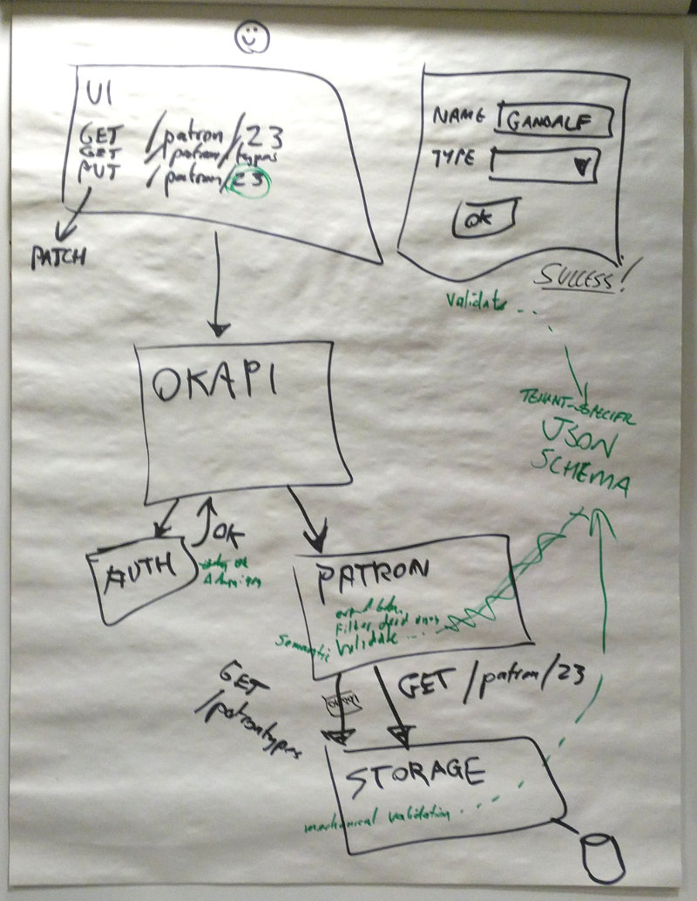
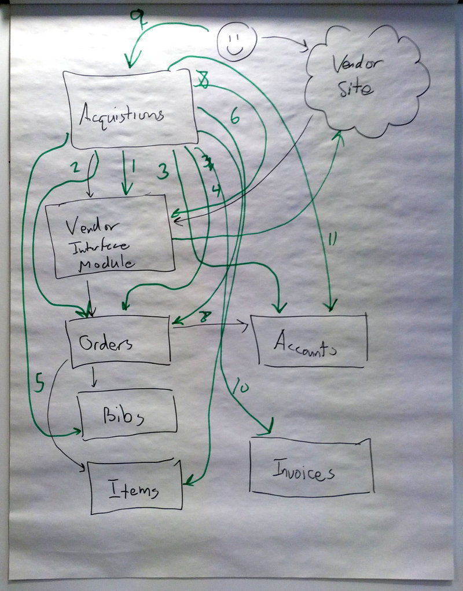

# Examples of complete operations in FOLIO

## Contents

* [Simple operation: view and edit a patron](#simple-operation-view-and-edit-a-patron)
    * [Phase 1: reading the patron record](#phase-1-reading-the-patron-record)
    * [Phase 2: reading the list of patron-types](#phase-2-reading-the-list-of-patron-types)
    * [Phase 3: updating the record](#phase-3-updating-the-record)
    * [Note: client-side validation](#note-client-side-validation)
* [Complex operation: acquisitions](#complex-operation-acquisitions)

In the meeting of 12 June 2016, we whiteboarded some complete
operations, to see how they would look in FOLIO. This document walks
through the API calls involved in those operations.

We may create clean diagrams at some point in the future. For now, we
use ugly photos of the whiteboards.

## Simple operation: view and edit a patron

We assume that the client has already performed a search or otherwise
identified patron record that he is interested. Then what happens?

### Phase 1: reading the patron record

* UI issues a request `GET /patrons/23` to Okapi.
* Okapi analyses which registered modules subscribe to that operation:
  The Auth and Patron modules will respond.
* Okapi determines from module metadata what permissions are required
  for the operation: `GET /patrons/:id` in the Patron module requires
  `viewPatrons`.
* Okapi now invokes the request on each appropriate module in turn: in
  this case, just Auth and Patron. First, authentication:
    * Okapi issues a request `GET /patrons/23` to Auth.
    * Auth determines who the logged-in user is, and what their
      permissions are.
    * If the user's permissions do not include `viewPatrons`, Auth
      returns 403 forbidden, and Okapi breaks off, returning the 403
      code to the client.
* If all is well, the Auth module allows the process to continue, and
  Okapi continues to the Patron module.
    * Okapi issues a request `GET /patrons/23` to Patron.
    * Patron requests the data from its storage module. NOTE: at
      present, we are not sure whether this is a dedicated Patron
      Storage module, or a generic storage module accessed via a
      Patron interface. But that doesn't matter for our present
      purposes.
    * The storage module retrieves patron record 23 and returns it to
      the Patron module.
* At this point, the Patron module, which understands business rules
  in its domain, has an opportunity to modify the record before
  returning it to Okapi. For example, it might decide that
  date-of-birth information is sensitive, and should be removed from
  the record unless the user has the `viewPatronSensitive` permission.
* The Patron module returns the (perhaps modified) record to Okapi.
* Okapi returns the (perhaps modified) record to the UI.
* The UI displays the patron record on the screen.

### Phase 2: reading the list of patron-types

When the UI displays an edit form for patrons, it needs to offer a
dropdown for patron-type (librarian, faculty, student, etc.) so the
user can change the type of the patron. In order to do this, it must
fetch the list of supported types from the Patron module.

This process is essentially the same as that of fetching the patron
record itself, but simpler as there is no need to filter sensitive
information.

To summarise: the UI issues a request `GET /patrons/types` to Okapi;
Okapi checks that the request is authorised; the Patron module
receives the request and returns the list of types to Okapi, which
returns it to the UI.

### Phase 3: updating the record

* UI issues a request `PATCH /patrons/23` to Okapi. (We use PATCH
  rather than PUT because in general we won't be sending the whole
  record: for example, we may be missing the date-of-birth field
  because the user was not authorised to see it.)
* As before, Okapi analyses which registered modules subscribe to that
  operation, and determines from module metadata what permissions are
  required for the operation: `PATCH /patrons/:id` in the Patron
  module requires `maintainPatrons`.
* Authentication takes place as for viewing, but using the
  `maintainPatrons` permission.
* If all is well, Okapi continues to the Patron module:
    * Okapi issues a request `PATCH /patrons/23` to Patron.
    * The Patron module performs "semantic validation" -- enforcing
      requirements that cannot be expressed declaratively but must be
      embodied in code. For example, it might allow a "child"
      patron-type to be upgraded to "adult", but not allow the
      reverse operation.
    * Assuming semantic validation is passed, the Patron module sends
      the patch request to its storage module.
    * The storage module performs mechanical validation of the
      submitted data by reference to the JSON Schema defined by the
      domain model. For example, this might enforce the requirement
      that the SSN field match the regexp `/[0-9-]+/`.
    * If this validation is passed, the storage module updates the
      specified fields in the patron record.
* The Patron module returns an OK status to Okapi, which returns it to
      the UI.

### Note: client-side validation

It is pleasant to avoid a server round-trip when validating user
input, so that the response to bad data is instantaneous. This can be
done to some degree by allowing the UI access to the JSON Schema, and
having it use the validation specifications on the client side. (It
can obtain the JSON Schema by asking the Patron module for it, or
perhaps from a separate Schema module.)

However, this can only be used to impose mechanical validation on the
client side. Semantic validations (such as the impossibility of
changing an adult patron to a child) can only be imposed by
Patron-specific business logic in the Patron module: so changes made
in the UI that pass mechanical validation but not semantic validation
will still require a server round-trip.

## Complex operation: acquisitions

This is described separately, in the **RPC Model** section of the
Google Doc _Acquisitions Hypothetical Event Flow_: https://docs.google.com/document/d/1j4S5yuK7et6NtE_noeEm7cAOkk-_WY6iXI6J7f3-BkM/edit#heading=h.rnu567237w3r

&nbsp;

&nbsp;

