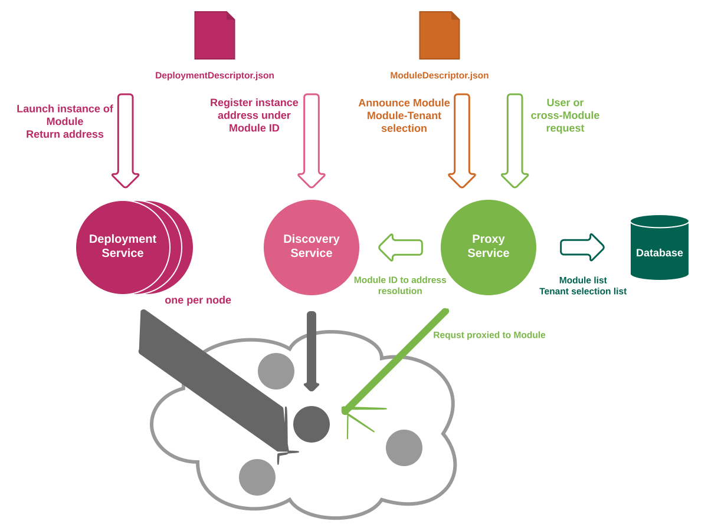

# Okapi Guide and Reference

This is the guide and reference to Okapi: a gateway for
managing and running microservices.

<!-- Regenerate this as needed by running `make guide-toc.md` and including its output here -->

* [Introduction](#introduction)
* [Architecture](#architecture)
    * [Okapi's own Web Services](#okapis-own-web-services)
    * [Deployment and Discovery](#deployment-and-discovery)
    * [Request Processing](#request-processing)
    * [Status Codes](#status-codes)
    * [Header Merging Rules](#header-merging-rules)
    * [Versioning and Dependencies](#versioning-and-dependencies)
    * [Security](#security)
    * [Open Issues](#open-issues)
* [Compiling and Running](#compiling-and-running)
* [Using Okapi](#using-okapi)
    * [Storage](#storage)
    * [Curl examples](#curl-examples)
    * [Example modules](#example-modules)
    * [Running Okapi itself](#running-okapi-itself)
    * [Example 1: Deploying and using a simple module](#example-1-deploying-and-using-a-simple-module)
    * [Example 2: Adding the Auth module](#example-2-adding-the-auth-module)
    * [Example 3: Upgrading, versions, environment, and the `_tenant` interface](#example-3-upgrading-versions-environment-and-the-_tenant-interface)
    * [Example 4: Complete ModuleDescriptor](#example-4-complete-moduledescriptor)
    * [Permissions and the `_tenantPermissions` Interface](#permissions-and-the-_tenantpermissions-interface)
    * [Optional interfaces](#optional-interfaces)
    * [Multiple interfaces](#multiple-interfaces)
    * [Cleaning up](#cleaning-up)
    * [Running in cluster mode](#running-in-cluster-mode)
    * [Securing Okapi](#securing-okapi)
    * [Module Descriptor Sharing](#module-descriptor-sharing)
    * [Install modules per tenant](#install-modules-per-tenant)
    * [install parameter preRelease](#install-parameter-prerelease)
    * [install parameter tenantParameters](#install-parameter-tenantparameters)
    * [install parameter invoke](#install-parameter-invoke)
    * [Upgrading modules per tenant](#upgrading-modules-per-tenant)
    * [Auto-deployment](#auto-deployment)
    * [Install jobs and asynchronous operations](#install-jobs-and-asynchronous-operations)
    * [Ignoring errors during install](#ignoring-errors-during-install)
    * [Purge module data](#purge-module-data)
* [Reference](#reference)
    * [Okapi program](#okapi-program)
    * [Logging](#logging)
    * [Environment Variables](#environment-variables)
    * [Web Service](#web-service)
    * [Internal Module](#internal-module)
    * [Deployment](#deployment)
    * [Docker](#docker)
    * [Kubernetes integration](#kubernetes-integration)
    * [System Interfaces](#system-interfaces)
    * [Timer management](#timer-management)
    * [Instrumentation](#instrumentation)
* [Module Reference](#module-reference)
    * [Life cycle of a module](#life-cycle-of-a-module)
    * [HTTP](#http)

## Introduction

This document aims to provide an overview of concepts that relate to
Okapi and the entire ecosystem around it (e.g. core vs modules) as
well as details of the implementation and usage of Okapi: by
presenting concrete web service endpoints and details of request
processing -- handling of request and response entities, status codes,
error conditions, etc.

Okapi is an implementation of some different patterns commonly used
within the microservice architecture. The most central of them is the
so called "API Gateway" pattern which is implemented by the core Okapi
'proxy' service.  Conceptually, the API Gateway is a server that is a
single entry point into the system. It is similar to the [Facade
pattern](http://en.wikipedia.org/wiki/Facade_pattern) from
object-oriented design. Per the [standard
definition](https://www.nginx.com/blog/building-microservices-using-an-api-gateway/),
which Okapi follows quite closely, _the API Gateway encapsulates the
internal system architecture and provides a unified API that may be
tailored to each client; it might also include core responsibilities
such as authentication, monitoring, load balancing, caching, request
shaping and management, and static response handling_: from the
Message Queue design pattern to allow broadcasting of requests to
multiple services (initially synchronously and eventually, possibly,
asynchronously) and returning a final response. Finally, Okapi
facilitates communication between services by acting as a Service
Discovery tool: service A wanting to talk to service B only needs to
know its HTTP interface since Okapi will inspect the registry of
available services to locate the physical instance of the service.

Okapi is designed to be configurable and extensible -- it allows one
to expose new, or enrich existing, web service endpoints without a
need for programmatic changes to the software itself. Registration of
new services ('modules' as seen from Okapi) happens by making calls to
the Okapi core web services. It is envisioned that the registration,
and associated core management tasks, will be performed by the Service
Provider administrator. This configurability and extensibility is
necessary to allow for app store features in which services or groups
of services ('applications') can be enabled or disabled per tenant on
demand.

## Architecture

Web service endpoints in Okapi can be, roughly, divided into two
parts: (1) general module and tenant management APIs, sometimes
referred to as 'core' -- initially part of Okapi itself but
potentially separable into their own services -- and (2) endpoints for
accessing module-provided, business-logic specific interfaces,
e.g. Patron management or Circulation. This document will discuss the
former in detail and offer a general overview of allowed formats and
styles for the latter.

The specification of the core Okapi web services, in its current form,
is captured in [RAML](http://raml.org/) (RESTful API Modeling
Language). See the [Reference](#web-service) section.  The
specification, however, aims to make very few assumptions about the
actual API endpoints exposed by specific modules, which are basically
left undefined.  The goal is to allow for different styles and formats
of those APIs (RESTful vs RPC and JSON vs XML, etc.) with only the
basic requirement of a common transport protocol (HTTP). It is
envisioned that the transport protocol assumption may be lifted or
worked around for some special cases (e.g. the ability to integrate
non-HTTP, binary protocols, such as a truly asynchronous protocol for
operation similar to a message queue).

### Okapi's own Web Services

As mentioned, Okapi's own web services provide the basic functionality
to set up, configure and enable modules and manage tenants. The core
endpoints are:

 * `/_/proxy`
 * `/_/discovery`
 * `/_/deployment`
 * `/_/env`

The special prefix `/_` is used to to distinguish the routing for
Okapi internal web services from the extension points provided by
modules.

 * The `/_/proxy` endpoint is used for configuring the proxying
   service: specifying which modules we know of, how their requests
   are to be routed, which tenants we know about, and which modules
   are enabled for which tenants.

 * The `/_/discovery` endpoint manages the mapping from service IDs to
   network addresses on the cluster. Information is posted to it, and
   the proxy service will query it to find where the needed modules
   are actually available. It also offers shortcuts for deploying and
   registering a module in one go. There is only a single discovery
   endpoint covering all of the nodes in a cluster. Requests to the
   discovery service can also deploy modules on specific nodes, so it
   is rarely necessary to invoke deployment directly.

 * The `/_/deployment` endpoint is responsible for deploying modules.
   In a clustered environment there should be one instance of the
   deployment service running on each node. It will be responsible for
   starting processes on that node, and allocating network addresses
   for the various service modules. It is mostly used internally, by
   the discovery service, but is left open in case some cluster
   management system could make use of it.

 * The `/_/env` endpoint is used to manage environment variables --
   system-wide properties that are passed to modules during
   deployment.

These four parts are coded as separate services, so that it will be
possible to use alternative deployment and discovery methods, if the
chosen clustering system offers such.



#### What are 'modules'?

Modules in the Okapi ecosystem are defined in terms of their
_behavior_ (or, in other words, _interface contract_) rather than
their _contents_, meaning there is no exact definition of a module as
a package or an archive, e.g. with the underlying file structure
standardized.  Those details are left to the particular module
implementation (as noted before, Okapi server-side modules can utilize
any technology stack).

Hence any piece of software that manifests the following traits can
become an Okapi module:

* It is an HTTP network server that communicates using a REST-styled
web service protocol -- typically, but not necessarily, with a JSON
payload.

* It comes with a descriptor file, namely the
[`ModuleDescriptor.json`](../okapi-core/src/main/raml/ModuleDescriptor.json),
which declares the basic module metadata (id, name, etc.), specifies
the module's dependencies on other modules (interface identifiers to
be precise), and reports all "provided" interfaces.

* `ModuleDescriptor.json` has a list of all `routes` (HTTP paths and
methods) that a given module handles, this gives Okapi necessary
information to proxy traffic to the module (this is similar to a
simplified RAML specification). Modules are identified in the `id`
property of the module descriptor. It consists of two components:
product and [semantic version](https://semver.org/) and separated by a
hyphen. Think of product as implementation. There should only be one
implementation enabled for a tenant at a time. The version component
specifies the version of the product and this combined serves as a
unique identifier for a module. In some cases, Okapi allows only the
product to be given, because it is obvious what module ID it corresponds
to. But in most other cases, the module ID must be given in full.

* It follows versioning rules defined in the chapter [_Versioning and
Dependencies_](#versioning-and-dependencies).

* WIP: it provides interfaces required for monitoring and
  instrumentation.

As you can see, none of those requirements specifically state rules
for deployment and, as such, it would be entirely possible to
integrate a third party web service (e.g. the API of a publicly
accessible Internet server) as an Okapi module. That is, assuming the
endpoint style and versioning semantics are a close match for what is
required in Okapi, and a suitable module descriptor can be written to
describe it.

Okapi, however, includes additional services (for service deployment
and discovery) that allows it to execute, run and monitor services
natively on a cluster that it manages. Those _native modules_ require
an additional descriptor file, the
[`DeploymentDescriptor.json`](../okapi-core/src/main/raml/DeploymentDescriptor.json),
which specifies the low-level information about how to run the
module. Also, native modules must be packaged according to one of the
packaging options supported by Okapi's deployment service: at this
point that means providing the executable (and all dependencies) on
each node or using on a self-contained Docker image to distribute the
executable from a centralized place.


#### API guidelines

Okapi's own web services must, and other modules should, adhere to
these guidelines as far as practically possible.

 * No trailing slashes in paths
 * Always expect and return proper JSON
 * The primary key should always be called 'id'

We try to make the Okapi code exemplary, so that it would serve well
as an example for other module developers to emulate.


#### Core Okapi Web Service Authentication and Authorization

Access to the core services (all resources under the `/_/` path) is
granted to the Service Provider (SP) administrator, as the
functionality provided by those services spans multiple tenants. The
details of authentication and authorization of the SP administrators
are to be defined at a later stage and will most likely be provided by
an external module that can hook into a specific Service Provider
authentication system.

### Deployment and Discovery

Making a module available to a tenant is a multi-step process. It can
be done in a few different ways, but the most usual process is:

 * We POST a ModuleDescriptor to `/_/proxy` , telling Okapi that we
know of such module, what services it offers, and what it depends on.
 * We POST to `/_/discovery` that we want to have this module running
on a given node, and it will tell the deploy service on that node to
start the necessary processes.
 * We enable the module for a given tenant.

We assume some external management program will be making these
requests.  It can not be a proper Okapi module itself, because it
needs to be running before any modules have been deployed. For
testing, see the curl command-line [examples](#using-okapi) later in
this document.

An alternative way is to not pass the Module ID to the Discovery, but
to pass a complete LaunchDescriptor. The ModuleDescriptor may not even
have a LaunchDescriptor in this case. This can be useful if running on
a cluster where the nodes are quite different, and you want to specify
exactly where the files are to be found. This is not the way we
imagine Okapi clusters to run, but we want to keep the option open.

Another alternative is to go to an even lower level, and POST the
LaunchDescriptor directly to the `/_/deployment` on any given
node. This means that the management software has to talk directly to
individual nodes, which raises all kind of questions about firewalls
etc. But it allows full control, which can be useful in some unusual
clustering setups. Note that you still need to post a ModuleDescriptor
to `/_/proxy` to let Okapi know about the module, but that the
`/_/deployment` will inform `/_/discovery` of the existence of the
module it has deployed.

Of course, you do not have to use Okapi to manage deployments at all,
you can POST a DeploymentDescriptor to `/_/discovery` and give a URL
instead of a LaunchDescriptor. That tells Okapi where the service
runs. It still needs a Service ID to connect the URL to a
ModuleDescriptor that you have POSTed earlier. Unlike the previous
examples, you need to provide a unique Instance Id for `/_/discovery`
to identify this instance of the module. This is necessary because you
can have the same module running on different URLs, presumably on
different nodes inside or external to your cluster. This method can be
useful if you make use of Okapi modules that exist outside your
cluster, or if you use some container system, perhaps a web server
where your modules live as CGI scripts at different URLs.

Note that the deployment and discovery stuff is transient, Okapi does
not store any of that in its database. If a node goes down, the
processes on it will die too. When it gets restarted, modules need to
be deployed on it again, either via Okapi, or through some other
means.

The discovery data is kept in a shared map, so as long as there is one
Okapi running on the cluster, the map will survive. But if the whole
cluster is taken down, the discovery data is lost. It would be fairly
useless at that point anyway.

In contrast, the ModuleDescriptors POSTed to `/_/proxy` are persisted
in a database.


### Request Processing

Modules can declare two kind ways to handle a request: handlers and
filters.  There should be exactly one handler for each path. That will
be of `request-response` type by default (see below). If no handlers
are found, Okapi will return a 404 NOTFOUND.

Each request may be passed through one or more filters. The `phase`
determines the order in which filters are applied. At the moment we
have three phases defined:
 * `auth` will be invoked first. It is used for checking the
X-Okapi-Token, and permissions.
 * `pre` will be invoked just before the handler. It is intended for
logging and reporting all requests.
 * `post` will be invoked just after the handler. It is intended for
logging and reporting all responses.

We expect to add more phases as necessary.

(In previous versions, we had handlers and filters combined in one
pipeline, with numerical levels for controlling the order. That was
deprecated in 1.2, and will be dropped in version 2.0)

The `type` parameter in the RoutingEntry in the Moduledescription
controls how the request is passed to the filters and handlers, and
how the responses are processed. Currently, we support the following
types:

 * `headers` -- The module is interested in headers/parameters only,
and it can inspect them and perform an action based on the
presence/absence of headers/parameters and their corresponding
value. The module is not expected to return any entity in the
response, but only a status code to control the further chain of
execution or, in the case of an error, an immediate termination. The
module may return certain response headers that will be merged into
the complete response header list according to the header manipulation
rules below.

 * `request-only` -- The module is interested in the full client
request: header/parameters and the entity body attached to the
request. The headers returned including the response code affects
further processing but the response body is ignored.  Note that type
`request-only` Okapi will buffer an incoming request body (POST
presumably) into memory. This does not scale for large import(s) or
the like. Use `request-log` instead if the response may be ignored.

 * `request-response` -- The module is interested in both
headers/parameters and the request body. It is also expected that the
module will return an entity in the response. This may be e.g. a
modified request body, in which case the module acts as a filter. The
returned response may then be forwarded on to the subsequent modules
as the new request body. Again, the chain of processing or termination
is controlled via the response status codes, and the response headers
are merged back into the complete response using the rules described
below.

* `redirect` -- The module does not serve this path directly, but
redirects the request to some other path, served by some other
module. This is intended as a mechanism for piling more complex
modules on top of simpler implementations, for example a module to
edit and list users could be extended by a module that manages users
and passwords. It would have actual code to handle creating and
updating users, but could redirect requests to list and get users to
the simpler user module. If a handler (or a filter) is marked as a
redirect, it must also have a redirectPath to tell where to redirect
to.

* `request-log` -- The module is interested in the full client
request: header/parameters and the entity body attached to the
request. This is similar to `request-only` but the entire response,
including headers and response code, is ignored by Okapi.  This type
appeared in Okapi version 2.23.0.

 * `request-response-1.0` -- This is like `request-response`, but
makes Okapi read the full body before POSTing to the module so that
Content-Length is set and chunked encoding is disabled. This is useful
for modules that have trouble dealing with chunked encoding or require
getting content length before inspecting. This type appeared in Okapi
2.5.0.

Most requests will likely be of type `request-response`, which is the
most powerful but potentially also most inefficient type, since it
requires content to be streamed to and from the module. Where more
efficient types can be used, they should be. For example, the
Authentication module's permission checking consults only the headers
of the request, and returns no body, so it is of type
`headers`. However, the same module's initial login request consults
the request body to determine the login parameters, and it also
returns a message; so it must be of type `request-response`.

Avoid using `request-only` and `request-response-1.0` if possible,
because those require Okapi to buffer whole HTTP request bodies into
memory.

Okapi has a feature where a module can exceptionally return a
X-Okapi-Stop header, and that will cause Okapi to terminate the
pipeline with the result this module returned. It is meant to be used
sparingly, for example a module in a login pipeline may conclude that
the user is already authorized since he comes from a IP address in the
secure office, and abort the sequence of events that would lead to a
login screen being displayed.

<a id="chunked"/>Although Okapi accepts both HTTP 1.0 and HTTP 1.1
requests, it uses HTTP 1.1 with chunked encoding to make the
connections to the modules. Exception: `request-response-1.0` as
explained above.


### Status Codes

Continuation or termination of the pipeline is controlled by a status
code returned by an executed module. Standard [HTTP status
code](https://www.w3.org/Protocols/rfc2616/rfc2616-sec10.html) ranges
are accepted in Okapi:

 * 2xx range: OK return codes; if a code in this range is returned by
a module, Okapi continues execution of the pipeline and forwards
information to the consecutive modules according to the rules
described above. At the end of the chain, the status returned by the
last module invoked is the one returned to the caller.

 * 3xx range: Redirect codes. The pipeline is terminated, and the
response (including any `Location` header) is immediately returned to
the caller.

 * 4xx-5xx range: user request errors or internal system errors; if a
code in this range is returned by a module, Okapi immediately
terminates the entire chain and returns the code back to the caller.

### Header Merging Rules

Since Okapi forwards the response from a previous module on to the
next module in the pipeline (e.g. for additional
filtering/processing), certain initial request headers become invalid,
e.g. when a module converts the entity to a different content type or
changes its size. Invalid headers need to be updated, based on the
module's response header values, before the request can be forwarded
to the next module. At the same time Okapi also collects a set of
response headers in order to produce a final response that is sent
back to the original client when the processing pipeline completes.

Both sets of headers are modified according to the following rules:

 * Any headers that provide metadata about the request entity body
(e.g.  Content-Type, Content-Length, etc.) are merged from the last
response back into the request.

 * An additional set of special debug and monitoring headers is merged
from the last response into the current request (in order to forward
them to the next module).

 * A list of headers that provide metadata about the response entity
body is merged to the final response header set.

 * An additional set of special headers (debug, monitoring) or any
other headers that should be visible in the final response is merged
into the final response header set.

Okapi always adds a X-Okapi-Url header to the request to any modules.
This tells the modules how they can make further calls to Okapi,
should they need to. This Url can be specified on the command line
when starting Okapi, and it can well point to some load balancer in
front of multiple Okapi instances.

### Versioning and Dependencies

Modules can provide one or more interfaces, and can consume interfaces
provided by other modules. The interfaces have versions, and
dependencies can require given versions of an interface. Okapi will
check dependencies and versions whenever a module is deployed, and
also when a module is enabled for a tenant.

Note that we can have multiple modules providing the same
interface. These can be deployed in Okapi simultaneously, but only one
such module can be enabled for any given tenant at a given time. For
example, we can have two ways to manage our patrons, one based on a
local database, one talking to an external system. The installation
can know both, but each tenant must choose one or the other.

When a module is created with a POST, the required dependencies are also
checked - even before it is enabled for a tenant. This is to ensure
that, at the very least, there are no modules that have dependencies that
would never be satisfied when eventually enabled for a tenant. It also
ensures that there are no cyclic dependencies.

#### Version numbers

We use a 3-part versioning scheme for module software versions, for
example `3.1.41` -- very much like [Semantic
Versioning](https://semver.org/).  Interface versions consist only of
the first two parts, as they have no implementation version.

The first number is the major version. It needs to be incremented
whenever making a change that is not strictly backwards compatible,
for example removing functionality or changing semantics.

The second number is the minor version. It needs to be incremented
whenever backwards-compatible changes are made, for example adding new
functionality or optional fields.

The third number is the software version. It should be incremented on
changes that do not affect the interface, for example fixing bugs or
improving efficiency.

Although it is strongly recommended to use this versioning schema for
all modules, Okapi does not enforce it for modules. The reason is that
Okapi does not need to know anything about module versions -- it only
worries about the interfaces being compatible.

Okapi does require that all modules that have the same id, will indeed
be the same piece of software. We have adopted a convention of using
ids that consist of a short name, followed by a software version. For
example "test-basic-1.2.0".

When checking interface versions, Okapi will require that the major
version number matches exactly what is required, and that the minor
version is at least as high as required.


If a module requires an interface 3.2, it will accept:
* 3.2 -- Same version
* 3.4 -- Higher minor version, compatible interfaces

But it will reject:
* 2.2 -- Lower major version
* 4.7 -- Higher major version
* 3.1 -- Lesser minor version

See further explanation of [Version
numbers](https://dev.folio.org/guidelines/contributing#version-numbers).

### Security

Most of the security discussion has been moved into its own document,
[Okapi Security Model](security.md).  This chapter of this Okapi Guide
just provides a quick overview.

The security model is concerned about three things:
* Authentication -- That we know who the user is.
* Authorization -- That the user is allowed to make this request.
* Permissions -- Mapping from user roles all the way down to detailed
permissions Most of this work has been delegated to modules, so Okapi
itself will not have to do so much work. But it still needs to
orchestrate the whole operation.

Ignoring all the messy details, this how it works: The client (often
on a web browser, but can really be anything) calls the `/authn/login`
service to identify itself. Depending on the tenant, we may have
different authorization modules serving the `/authn/login` request,
and they may take different parameters (username and password are the
most likely, but we can have anything from simple IP authentication to
complex interactions with LDAP, OAuth, or other systems).

The authorization service returns a token to the client, and the
client passes this token in a special header in all requests it makes
to Okapi. Okapi in turn passes it to the authorization module,
together with information of what modules will be called to satisfy
the request, and what permissions those modules require and desire,
and if they have special module level permissions. The authorization
service checks the permissions. If required permissions are not there,
the whole request is denied. If all is well, the module returns
information about the desired permissions, and possibly special tokens
to be passed to some modules.

Okapi passes the request to each module in the pipeline in turn. Each
of them get information of the desired permissions, so they can alter
the behavior as needed, and a token that they can use for further
calls.

The trivial okapi-test-auth-module module included in the Okapi source
tree does not implement much of this scheme. It is there just to help
us test the parts that Okapi needs to handle.

### Open Issues

#### Caching

Okapi can provide an additional caching layer between modules,
especially in busy, read-heavy, multi-module pipelines. We plan to
follow standard HTTP mechanisms and semantics in this respect, and
implementation details will be established within the coming months.

#### Instrumentation and Analytics

In a microservices architecture, monitoring is key to ensure
robustness and health of the entire system. The way to provide useful
monitoring is to include well-defined instrumentation points ("hooks")
before and after each step of execution of the request processing
pipeline. Besides monitoring, instrumentation is crucial for the
ability to quickly diagnose issues in the running system ("hot"
debugging) and discovering performance bottlenecks (profiling). We are
looking at established solutions in this regard: e.g. JMX, Micrometer
Metrics, Graphite, etc.

A multi-module system may provide a wide variety of metrics and an
immense amount of measurement data. Only a fraction of this data can
be analyzed at runtime, most of it must be captured for analysis at a
later stage. Capturing and storing data in a form that lends itself to
an effortless post factum analysis is essential for analytics and we
are looking into integration between open and popular solutions and
Okapi.

#### Response Aggregation

There is no direct support for response aggregation in Okapi at the
moment, as Okapi assumes sequential execution of the pipeline and
forwards each response to the next module in the pipeline. In this
mode, it is entirely possible to implement an aggregation module that
will communicate with multiple modules (via Okapi, to retain the
provided authentication and service discovery) and combine the
responses. In further releases a more generic approach to response
aggregation will be evaluated.

#### Asynchronous messaging

At present, Okapi assumes and implements HTTP as the transport
protocol between modules, both on the front-end and within the
system. HTTP is based on a request-response paradigm and does not
directly include asynchronous messaging capabilities.  It is, however,
entirely possible to model an asynchronous mode of operation on top of
HTTP, e.g. using a polling approach or HTTP extensions like
websockets. We anticipate that for future releases of Okapi we will
investigate the asynchronous approach in depth and provide support for
some open messaging protocols (e.g. STOMP).

## Compiling and Running

The latest source of the software can be found at
[GitHub](https://github.com/folio-org/okapi).

The build requirements are:

 * Apache Maven 3.3.1 or later.
 * Java 8 JDK
 * [Git](https://git-scm.com) 2

As usual, do all development and running as a regular user, not as root.

So with those requirements available, now build with:

```
git clone --recursive https://github.com/folio-org/okapi.git
cd okapi
mvn install
```

The install rule also runs tests. Tests should not fail.
If they do then please report it, and in the meantime fall back to:

```
mvn install -DskipTests
```

If successful, the output of `mvn install` should have this line near
the end:

```
[INFO] BUILD SUCCESS
```

Some tests use embedded databases, which takes time to run. In order to
skip these tests, use something like:
```
mvn install -DtestStorage=inmemory
```

The `okapi` directory contains a few sub modules. These are:

 * `okapi-core` -- The gateway server itself.
 * `okapi-common` -- Utilities used by both gateway and modules.
 * `doc` -- Documentation, including this guide.
 * `okapi-test-auth-module` -- A simple module for testing authentication stuff.
 * `okapi-test-module` -- A module mangling HTTP content for test purposes.
 * `okapi-test-header-module` -- A module to test headers-only mode.

(Note the build order specified in the `pom.xml`:
okapi-core must be last because its tests rely on the previous ones.)

The result for each module and okapi-core is a combined jar file
with all necessary components combined, including Vert.x. The listening
port is adjusted with property `http.port` or `port`.

For example, to run the okapi-test-auth-module module and listen on port 8600, use:

```
cd okapi-test-auth-module
java -Dhttp.port=8600 -jar target/okapi-test-auth-module-fat.jar
```

In the same way, to run the okapi-core, specify its jar file. It is
also necessary to provide a further command-line argument: a command
telling okapi-core what mode to run in. When playing with Okapi on a
single node, we use the `dev` mode.

```
cd okapi-core
java -Dhttp.port=8600 -jar target/okapi-core-fat.jar dev
```

There are other commands available. Supply `help` to get a description of
these.

A Maven rule to run the gateway is provided as part of the `pom.xml`,
in the main directory.

```
mvn exec:exec
```
This will start the okapi-core and make it listen on its default port: 9130.

For remote debugging you can use
```
mvn exec:exec@debug
```
This command requires Maven >= 3.3.1. It will listen for a
debugging client on port 5005.

For running in a cluster, see the [Cluster](#running-in-cluster-mode)
example below.

## Using Okapi

These examples show how to use Okapi from the command line, using the `curl`
http client. You should be able to copy and paste the commands to your
command line from this document.

The exact definition of the services is in the RAML files listed in
the [Reference](#web-service) section.

### Storage

Okapi defaults to an internal in-memory mock storage, so it can run without
any database layer under it. This is fine for development and testing, but of
course in real life we will want some of our data to persist from one invocation
to the next. At the moment, MongoDB and PostgreSQL storage can be enabled by
option `-Dstorage=mongo` and  `-Dstorage=postgres` respectively to the command
line that starts Okapi.

We are moving away from the Mongo backend. For its command line options, you
will have to look in the code in MongoHandle.java.

Initializing the PostgreSQL database is a two-step operation. First we need to
create a user and a database in PostgreSQL. This needs to be only once on any
given machine. On a Debian box that will be something like this:
```
   sudo -u postgres -i
   createuser -P okapi   # When it asks for a password, enter okapi25
   createdb -O okapi okapi
```
The values 'okapi', 'okapi25', and 'okapi' are defaults intended for
development use only. In real production, some DBA will have to set up
a proper database and its parameters, which will need to be passed to
Okapi on the command line.

The second step is creating the necessary tables and indexes. Okapi
will do this for you on startup if you are starting from an empty
database. In addition, Okapi offers special-purpose commands to manage
database initialization and purging.

  * `initdatabase`: removes existing tables and data if available and creates
    the necessary stuff, and exits Okapi.
  * `purgedatabase`: removes existing tables and data only, does not
    reinitialize.

For more information on Okapi commands, see the
[Okapi program reference](#okapi-program).

If you need to dig into Okapi's PostgreSQL database, you can do it with a
command like this:
```
psql -U okapi postgresql://localhost:5432/okapi
```


### Curl examples

The examples in the following sections can be pasted into a command-line console.

It is also possible to extract all the example records with a perl
one-liner, assuming you have this MarkDown source of this guide in the
current directory as _guide.md_ -- as is the case in the source tree.
This leaves them all in `/tmp` as files like `okapi-tenant.json`
```
perl -n -e 'print if /^cat /../^END/;' guide.md | sh
```

After that, it is also possible to run all the examples with a slightly more
complex command:

```
perl -n -e 'print if /^curl /../http/; ' guide.md |
  grep -v 8080 | grep -v DELETE |
  sh -x
```

(See the script `doc/okapi-examples.sh` which runs the above two commands.)

This explicitly omits the cleaning up DELETE commands, so it leaves Okapi in a
well-defined state with a few modules enabled for a few known tenants.

### Example modules

Okapi is all about invoking modules, so we need to have a few to play with.
It comes with three dummy modules that demonstrate different things.

Note that these are only intended for demonstration and test purposes.
Do not base any real modules on these.

There are additional modules in the separate repository
[folio-sample-modules](https://github.com/folio-org/folio-sample-modules).

#### Okapi-test-module

This is a very simple module. If you make a GET request to it, it will reply "It
works". If you POST something to it, it will reply with "Hello" followed by
whatever you posted. It can do a few other tricks too, like echoing request
headers. These are used in the tests for okapi-core.

Normally Okapi will be starting and stopping these modules for you, but we will
run this one directly for now -- mostly to see how to use curl, a
command-line HTTP client that is useful for testing.

Open a console window, navigate to the okapi project root and issue the command:

```
java -jar okapi-test-module/target/okapi-test-module-fat.jar
```

This starts the okapi-test-module listening on port 8080.

Now open another console window, and try to access the
test module with:

```
curl -w '\n' http://localhost:8080/testb
```

It should tell you that it works.

The option "`-w '\n'`" is just to make curl output an extra newline,
because the responses do not necessarily end in newlines.

Now we will try to POST something to the test module. In real life this
would be a JSON structure, but for now a simple text string will do.

```
echo "Testing Okapi" > okapi.txt
curl -w '\n' -X POST -d @okapi.txt http://localhost:8080/testb
```

Again we have the -w option to get a newline in the output, and this
time we add `-X POST` to make it a post request, and `-d @okapi.txt`
to specify the name of the file containing the data that we want to
post.

The test module should respond with

    Hello Testing Okapi

which is our test data, with a "Hello" prepended to it.

That is enough about the okapi-test-module for now. Go back to the window
where you left it running, and kill it with a `Ctrl-C` command. It should
not have produced any output after the initial messages.

#### Okapi-test-header-module

The `test-header` module demonstrates the use of a type=headers module; that is
a module which inspects HTTP headers and produces a new set of HTTP headers.
The response body is ignored and should be empty.

Start with:

```
java -jar okapi-test-header-module/target/okapi-test-header-module-fat.jar
```

The module reads `X-my-header` from leading path `/testb`. If that header is
present, it will take its value and append `,foo`.
If no such header is present, it will use the value `foo`.

These two cases can be demonstrated with:

```
curl -w '\n' -D- http://localhost:8080/testb
```
and
```
curl -w '\n' -H "X-my-header:hey" -D- http://localhost:8080/testb
```

As above, now stop that simple verification.

#### Okapi-test-auth-module

Okapi itself does not do authentication: it delegates that to a
module. In real life, the auth stuff is divided between different
modules, for example mod-authtoken, mod-login, and mod-permissions,
but for our test purposes we have a dummy module that can be used to
demonstrate how it works.

The dummy module supports two functions: `/authn/login` is, as its
name implies, a login function that takes a username and password, and
if acceptable, returns a token in a HTTP header. Any other path goes
through the check function that checks that we have a valid token in
the HTTP request headers.

We will see examples of this when we get to play with Okapi itself. If
you want, you can verify the module directly as with the okapi-test-module.

### Running Okapi itself

Now we are ready to start Okapi.
Note: for this example to work it is important that the current directory
of the Okapi is the top-level directory `.../okapi`.

```
java -Dtrace_headers=true -jar okapi-core/target/okapi-core-fat.jar dev
```

The `dev` command tells to run it in development mode, which makes it start
with a known clean state without any modules or tenants defined.

Setting `trace_headers` to `true` makes Okapi return HTTP header
`X-Okapi-Trace` with information about modules involved in a call.

Okapi lists its PID (process ID) and says `API Gateway started`.  That
means it is running, and listening on the default port which happens
to be 9130, and using in-memory storage. (To use PostgreSQL storage
instead, add `-Dstorage=postgres` to the [command
line](#java--d-options).)

When Okapi starts up for the first time, it checks if we have a
ModuleDescriptor for the internal module that implements all the
endpoints we use in this example.  If not, it will create it for us,
so that we can use Okapi itself. We can ask Okapi to list the known
modules:

```
curl -w '\n' -D -  http://localhost:9130/_/proxy/modules

HTTP/1.1 200 OK
Content-Type: application/json
X-Okapi-Trace: GET okapi-2.29.0-SNAPSHOT /_/proxy/modules : 200 8081us
Content-Length: 60

[ {
  "id" : "okapi-2.29.1-SNAPSHOT",
  "name" : "Okapi"
} ]
```

The version number will change over time. This example was run on a
development branch, so the version has the `-SNAPSHOT` suffix.

Since all Okapi operations are done on behalf of a tenant, Okapi will
make sure that we have at least one defined when we start up. Again,
you can see it with:

```
curl -w '\n' -D - http://localhost:9130/_/proxy/tenants

HTTP/1.1 200 OK
Content-Type: application/json
X-Okapi-Trace: GET okapi-2.29.0-SNAPSHOT /_/proxy/tenants : 200 450us
Content-Length: 105

[ {
  "id" : "supertenant",
  "name" : "supertenant",
  "description" : "Okapi built-in super tenant"
} ]
```

### Example 1: Deploying and using a simple module

So we need to tell Okapi that we want to work with some modules. In real life
these operations would be carried out by a properly authorized administrator.

As mentioned above, the process consists of three parts: deployment, discovery,
and configuring the proxying.

#### Deploying the test-basic module

To tell Okapi that we want to use the `okapi-test-module`, we create a JSON
structure of a moduleDescriptor and POST it to Okapi:

```
cat > /tmp/okapi-proxy-test-basic.1.json <<END
{
  "id": "test-basic-1.0.0",
  "name": "Okapi test module",
  "provides": [
    {
      "id": "test-basic",
      "version": "2.2",
      "handlers": [
        {
          "methods": [ "GET", "POST" ],
          "pathPattern": "/testb",
          "permissionsRequired": [ "test-basic.get.list" ]
        }
      ]
    }
  ],
  "requires": [],
  "launchDescriptor": {
    "exec": "java -Dhttp.port=%p -jar okapi-test-module/target/okapi-test-module-fat.jar"
  }
}
END
```

The id is what we will be using to refer to this module later. The
version number is included in the id, so that the id uniquely
identifies exactly what module we are talking about. (Okapi does not
enforce this, it is also possible to use UUIDs or other things, as
long as they are truly unique, but we have decided to use this naming
scheme for all modules.)

This module provides just one interface, called `test-basic`. It has
one handler that indicates that the interface is interested in GET and
POST requests to the /testb path and nothing else.

The launchDescriptor tells Okapi how this module is to be started and
stopped.  In this version we use a simple `exec` command line. Okapi
will start a process, remember the PID, and just kill it when we are
done.

The moduleDescriptor can contain much more stuff, more about that in
later examples.

So, let's post it:
```
curl -w '\n' -X POST -D - \
  -H "Content-type: application/json" \
  -d @/tmp/okapi-proxy-test-basic.1.json \
  http://localhost:9130/_/proxy/modules

HTTP/1.1 201 Created
Content-Type: application/json
Location: /_/proxy/modules/test-basic-1.0.0
X-Okapi-Trace: POST okapi-2.29.0-SNAPSHOT /_/proxy/modules : 201 9786us
Content-Length: 370

{
  "id" : "test-basic-1.0.0",
  "name" : "Okapi test module",
  "requires" : [ ],
  "provides" : [ {
    "id" : "test-basic",
    "version" : "2.2",
    "handlers" : [ {
      "methods" : [ "GET", "POST" ],
      "pathPattern" : "/testb",
      "permissionsRequired": [ "test-basic.get.list" ]
    } ]
  } ],
  "launchDescriptor" : {
    "exec" : "java -Dhttp.port=%p -jar okapi-test-module/target/okapi-test-module-fat.jar"
  }
}
```

Okapi responds with a "201 Created", and reports back the same JSON. There is
also a Location header that shows the address of this module, if we want to
modify or delete it, or just look at it, like this:

```
curl -w '\n' -D - http://localhost:9130/_/proxy/modules/test-basic-1.0.0
```

We can also ask Okapi to list all known modules, like we did in the beginning:
```
curl -w '\n' http://localhost:9130/_/proxy/modules
```
This shows a short list of two modules, the internal one, and the one we just
posted.

Note that Okapi gives us less details about the modules, for in the real life this
could be quite a long list.

#### Deploying the module

It is not enough that Okapi knows that such a module exists. We must
also deploy the module. Here we must note that Okapi is meant to be
running on a cluster with many nodes, so we must decide on which one
to deploy it.  First we must check what clusters we have to work with:

```
curl -w '\n' http://localhost:9130/_/discovery/nodes
```

Okapi responds with a short list of only one node:

```
[ {
  "nodeId" : "localhost",
  "url" : "http://localhost:9130"
} ]
```

This is not surprising, we are running the whole thing on one machine,
in 'dev' mode, so we only have one node in the cluster and by default
it is called 'localhost'.  If this was a real cluster, each node would
have its own id, either given on Okapi command line when started on
that node, or an ugly UUID assigned by the cluster manager. So let's
deploy it there.

First we create a DeploymentDescriptor:

```
cat > /tmp/okapi-deploy-test-basic.1.json <<END
{
  "srvcId": "test-basic-1.0.0",
  "nodeId": "localhost"
}
END
```

And then we POST it to `/_/discovery`. Note that we do not post to
`/_/deployment` although we could do so. The difference is that for
`deployment` we would need to post to the actual node, whereas
discovery is responsible for knowing what runs on which node, and is
available on any Okapi on the cluster.  In a production system there
would probably be a firewall preventing any direct access to the
nodes.

```
curl -w '\n' -D - -s \
  -X POST \
  -H "Content-type: application/json" \
  -d @/tmp/okapi-deploy-test-basic.1.json \
  http://localhost:9130/_/discovery/modules
```

Okapi responds with
```
HTTP/1.1 201 Created
Content-Type: application/json
Location: /_/discovery/modules/test-basic-1.0.0/localhost-9131
X-Okapi-Trace: POST okapi-2.29.0-SNAPSHOT /_/discovery/modules : 201 1025424us
Content-Length: 259

{
  "instId" : "edb1a2e2-752f-4317-bcf5-4818c48397a3",
  "srvcId" : "test-basic-1.0.0",
  "nodeId" : "localhost",
  "url" : "http://localhost:9131",
  "descriptor" : {
    "exec" : "java -Dhttp.port=%p -jar okapi-test-module/target/okapi-test-module-fat.jar"
  }
}
```

There is a bit more detail than what we posted to it. We only gave it
the service Id "test-basic-1.0.0", and it went ahead and looked up the
LaunchDescriptor from the ModuleDescriptor we posted earlier, with
this id.

Okapi has also allocated a port for this module, 9131, and given it a
unique instance ID, It must be unique, since we can have multiple
instances of the same module running on different nodes, or even the
same one.

Finally Okapi also returns the URL that the module is listening on.
In a real life cluster there would be a firewall preventing any direct
access to the modules, since all traffic must go through Okapi for
authorization checks, logging, etc.  But in our simple test example,
we can verify that the module is actually running on that URL. Well,
not exactly that URL, but a URL that we get when we combine the path
from the handler with the base URL above:

```
curl -w '\n' http://localhost:9131/testb

It works
```

#### Creating a tenant

As noted above, all traffic should be going through Okapi, not
directly to the modules. But if we try Okapi's own base URL we get:

```
curl -D - -w '\n' http://localhost:9130/testb

HTTP/1.1 404 Not Found
Content-Type: text/plain
Content-Length: 63

No suitable module found for path /testb for tenant supertenant
```

Notice the failure. Okapi defaults to tenant `supertenant`, but since
our module is not enabled for that tenant, it returns 'not found'.

Okapi is a multi-tenant system, so each request must be done on behalf
of some tenant. We could use the supertenant, but that would be bad
practice.

Let's create a test tenant for this example. It is not very
difficult:

```
cat > /tmp/okapi-tenant.json <<END
{
  "id": "testlib",
  "name": "Test Library",
  "description": "Our Own Test Library"
}
END

curl -w '\n' -X POST -D - \
  -H "Content-type: application/json" \
  -d @/tmp/okapi-tenant.json \
  http://localhost:9130/_/proxy/tenants

HTTP/1.1 201 Created
Content-Type: application/json
Location: /_/proxy/tenants/testlib
X-Okapi-Trace: POST okapi-2.29.0-SNAPSHOT /_/proxy/tenants : 201 1065us
Content-Length: 91

{
  "id" : "testlib",
  "name" : "Test Library",
  "description" : "Our Own Test Library"
}
```

#### Enabling the module for our tenant

Next we need to enable the module for our tenant. This is even simpler
operation:

```
cat > /tmp/okapi-enable-basic-1.json <<END
{
  "id": "test-basic-1.0.0"
}
END

curl -w '\n' -X POST -D - \
  -H "Content-type: application/json" \
  -d @/tmp/okapi-enable-basic-1.json \
  http://localhost:9130/_/proxy/tenants/testlib/modules

HTTP/1.1 201 Created
Content-Type: application/json
Location: /_/proxy/tenants/testlib/modules/test-basic-1.0.0
X-Okapi-Trace: POST okapi-2.29.0-SNAPSHOT /_/proxy/tenants/testlib/modules : 201 11566us
Content-Length: 31

{
  "id" : "test-basic-1.0.0"
}
```


#### Calling the module

So, now we have a tenant, and it has a module enabled. Last time we
tried to call the module, Okapi responded with "Missing tenant". We
need to add the tenant in our calls, as an extra header:

```
curl -D - -w '\n' \
  -H "X-Okapi-Tenant: testlib" \
  http://localhost:9130/testb

HTTP/1.1 200 OK
Content-Type: text/plain
X-Okapi-Trace: GET test-basic-1.0.0 http://localhost:9131/testb : 200 5632us
Transfer-Encoding: chunked

It works
```

#### Another way

There is another way to invoke a module for a given tenant, as shown below:

```
curl -w '\n' -D - \
  http://localhost:9130/_/invoke/tenant/testlib/testb

It works!
```

This is a bit of a hack, for some special cases where we can not
control the headers in the request, for example a callback from a SSO
service. This is quite limited, it will fail for calls that require an
auth token (see below).  We may add a path to
`/_/invoke/token/xxxxxxx/....` later for such cases.

The invoke endpoint was added in Okapi 1.7.0


### Example 2: Adding the Auth module

The previous example works for anyone who can guess a tenant ID. That
is fine for a small test module, but real life modules do real work,
and need to be restricted to privileged users. In real life we would
have a complex set of modules managing all kind of authentication and
authorization stuff, but for this example we only have Okapi's own
test-auth module to play with. It will not do any serious
authentication, but will be just enough to demonstrate how to use one.

As before, the first thing we create is a ModuleDescriptor:
```
cat > /tmp/okapi-module-auth.json <<END
{
  "id": "test-auth-3.4.1",
  "name": "Okapi test auth module",
  "provides": [
    {
      "id": "test-auth",
      "version": "3.4",
      "handlers": [
        {
          "methods": [ "POST" ],
          "pathPattern": "/authn/login",
          "permissionsRequired" : [ ]
        }
      ]
    },
    {
      "id": "_tenantPermissions",
      "version": "1.0",
      "interfaceType": "system",
      "handlers": [
        {
          "methods": [ "POST" ],
          "pathPattern": "/_/tenantPermissions",
          "permissionsRequired" : [ ]
        }
      ]
    }
  ],
  "requires": [],
  "filters": [
    {
      "methods": [ "*" ],
      "pathPattern": "/*",
      "phase": "auth",
      "type": "headers"
    }
  ]
}
END
```

The module has one handler, for the `/authn/login` path. It also has a
filter that connects with every incoming request. That is where it
decides if the user will be allowed to make the request. This one has
a type "headers", which means that Okapi does not pass the whole
request to it, just the headers. In real world, these two services can
well come from different modules, for example mod-authtoken for the
filtering, and some kind of mod-login for authenticating the user.

The pathPattern for the filter uses the wildcard character (`*`) to
match any path.  A pathPattern may also include curly braces pairs to
match a path component. For example `/users/{id}` would match
`/users/abc`, but not `/users/abc/d`.

The phase specifies at which stage the filter is to be applied. At
this point, we only have one commonly used phase, "auth", which gets
invoked well before the handlers. There are two others, "pre" and
"post", which will be invoked right before and after the handler,
respectively. We may define more phases as necessary.

We could have included a launchDescriptor as before, but just to
demonstrate another way, we have omitted it here. Doing it this way
may make more sense in a clustered environment where each module
instance may need some extra command-line arguments or environment
variables.

So we POST it to Okapi:

```
curl -w '\n' -X POST -D - \
  -H "Content-type: application/json" \
  -d @/tmp/okapi-module-auth.json \
  http://localhost:9130/_/proxy/modules

HTTP/1.1 201 Created
Content-Type: application/json
Location: /_/proxy/modules/test-auth-3.4.1
X-Okapi-Trace: POST okapi-2.29.0-SNAPSHOT /_/proxy/modules : 201 1614us
Content-Length: 377

{
  "id" : "test-auth-3.4.1",
  "name" : "Okapi test auth module",
  "requires" : [ ],
  "provides" : [ {
    "id" : "test-auth",
    "version" : "3.4",
    "handlers" : [ {
      "methods" : [ "POST" ],
      "pathPattern" : "/authn/login",
      "permissionsRequired" : [ ]
    } ]
  }, {
    "id" : "_tenantPermissions",
    "version" : "1.0",
    "interfaceType" : "system",
    "handlers" : [ {
      "methods" : [ "POST" ],
      "pathPattern" : "/_/tenantPermissions",
      "permissionsRequired" : [ ]
    } ]
  } ],
  "filters" : [ {
    "methods" : [ "*" ],
    "pathPattern" : "/*",
    "phase" : "auth",
    "type" : "headers"
  } ]
}
```

Next we need to deploy the module. Since we did not put a launchDescriptor
in the moduleDescriptor, we need to provide one here.

```
cat > /tmp/okapi-deploy-test-auth.json <<END
{
  "srvcId": "test-auth-3.4.1",
  "nodeId": "localhost",
  "descriptor": {
    "exec": "java -Dhttp.port=%p -jar okapi-test-auth-module/target/okapi-test-auth-module-fat.jar"
  }
}
END

curl -w '\n' -D - -s \
  -X POST \
  -H "Content-type: application/json" \
  -d @/tmp/okapi-deploy-test-auth.json \
  http://localhost:9130/_/discovery/modules

HTTP/1.1 201 Created
Content-Type: application/json
Location: /_/discovery/modules/test-auth-3.4.1/localhost-9132
X-Okapi-Trace: POST okapi-2.29.0-SNAPSHOT /_/discovery/modules : 201
Content-Length: 268

{
  "instId" : "85a7edcd-9360-413f-a577-284a5edf5e28",
  "srvcId" : "test-auth-3.4.1",
  "nodeId" : "localhost",
  "url" : "http://localhost:9132",
  "descriptor" : {
    "exec" : "java -Dhttp.port=%p -jar okapi-test-auth-module/target/okapi-test-auth-module-fat.jar"
  }
}
```

And we enable the module for our tenant:

```
cat > /tmp/okapi-enable-auth.json <<END
{
  "id": "test-auth-3.4.1"
}
END

curl -w '\n' -X POST -D - \
  -H "Content-type: application/json" \
  -d @/tmp/okapi-enable-auth.json \
  http://localhost:9130/_/proxy/tenants/testlib/modules

HTTP/1.1 201 Created
Content-Type: application/json
Location: /_/proxy/tenants/testlib/modules/test-auth-3.4.1
X-Okapi-Trace: POST okapi-2.0.1-SNAPSHOT /_/proxy/tenants/testlib/modules : 201 1693us
Content-Length: 30

{
  "id" : "test-auth-3.4.1"
}
```

So, the auth module should now intercept every call we make to Okapi,
and check if we are authorized for it. Let's try with the same call to
the basic module as before:

```
curl -D - -w '\n' \
  -H "X-Okapi-Tenant: testlib" \
  http://localhost:9130/testb

HTTP/1.1 401 Unauthorized
Content-Type: text/plain
X-Okapi-Trace: GET test-auth-3.4.1 http://localhost:9132/testb : 401 64187us
Transfer-Encoding: chunked

Permissions required: test-basic.get.list
```

Indeed, we are no longer allowed to call the test module. So, how do
we get the permission? The error message says that we need a
`test-basic.get.list` permission. Those we can get from the login
service. The dummy auth module is not very clever in verifying
passwords, it assumes that for username "peter" we have a password
"peter-password". Not overly secure, but enough for this example.

```
cat > /tmp/okapi-login.json <<END
{
  "tenant": "testlib",
  "username": "peter",
  "password": "peter-password"
}
END

curl -w '\n' -X POST -D - \
  -H "Content-type: application/json" \
  -H "X-Okapi-Tenant: testlib" \
  -d @/tmp/okapi-login.json \
  http://localhost:9130/authn/login

HTTP/1.1 200 OK
X-Okapi-Trace: POST test-auth-3.4.1 http://localhost:9132/authn/login : 202 4539us
Content-Type: application/json
X-Okapi-Token: dummyJwt.eyJzdWIiOiJwZXRlciIsInRlbmFudCI6InRlc3RsaWIifQ==.sig
X-Okapi-Trace: POST test-auth-3.4.1 http://localhost:9132/authn/login : 200 159934us
Transfer-Encoding: chunked

{  "tenant": "testlib",  "username": "peter",  "password": "peter-password"}
```

The response just echoes its parameters, but notice that we get back a
header `X-Okapi-Token:
dummyJwt.eyJzdWIiOiJwZXRlciIsInRlbmFudCI6InRlc3RsaWIifQ==.sig`.  We
are not supposed to worry about what that header contains, but we can
see its format is almost as you would expect from a JWT: Three parts
separated by dots, first a header, then a base-64 encoded payload, and
finally a signature. The header and signature would normally be
base-64 encoded as well, but the simple test-auth module skips that
part, to make a distinct token that can not be mistaken as a real
JWT. The payload is indeed base-64 encoded, and if you decode it, you
see that it will contain a JSON structure with the user id and the
tenant id, and nothing much else. A real-life auth module would of
course put more stuff in the JWT, and sign it with some strong
crypto. But that should make no difference to Okapi's users -- all
that they need to know is how do we get a token, and how to pass it on
in every request. Like this:

```
curl -D - -w '\n' \
  -H "X-Okapi-Tenant: testlib" \
  -H "X-Okapi-Token: dummyJwt.eyJzdWIiOiJwZXRlciIsInRlbmFudCI6InRlc3RsaWIifQ==.sig" \
  http://localhost:9130/testb

HTTP/1.1 200 OK
X-Okapi-Trace: GET test-auth-3.4.1 http://localhost:9132/testb : 202 15614us
Content-Type: text/plain
X-Okapi-Trace: GET test-basic-1.0.0 http://localhost:9131/testb : 200 1826us
Transfer-Encoding: chunked

It works
```

We can also post things to our test module:
```
curl -w '\n' -X POST -D - \
  -H "Content-type: application/json" \
  -H "X-Okapi-Tenant: testlib" \
  -H "X-Okapi-Token: dummyJwt.eyJzdWIiOiJwZXRlciIsInRlbmFudCI6InRlc3RsaWIifQ==.sig" \
  -d '{ "foo":"bar"}' \
  http://localhost:9130/testb
```
The module responds with the same JSON, but prepends "Hello" to the string.

The [https://github.com/MikeTaylor/okapi-curl](https://github.com/MikeTaylor/okapi-curl)
shell script simplifies the login and adding the header lines.


### Example 3: Upgrading, versions, environment, and the `_tenant` interface

Upgrading can often be problematic. More so in Okapi, since we are
serving many tenants, who will have different ideas about when and
what to upgrade. In this example we go through the upgrading process,
discuss versions, environment variables, and also look at the special
`_tenant` system interface.

Let's say we have a new and improved sample module:
```
cat > /tmp/okapi-proxy-test-basic.2.json <<END
{
  "id": "test-basic-1.2.0",
  "name": "Okapi test module, improved",
  "provides": [
    {
      "id": "test-basic",
      "version": "2.4",
      "handlers": [
        {
          "methods": [ "GET", "POST" ],
          "pathPattern": "/testb",
          "permissionsRequired": [ "test-basic.get.list" ]
        }
      ]
    },
    {
      "id": "_tenant",
      "version": "1.0",
      "interfaceType": "system",
      "handlers": [
        {
          "methods": [ "POST" ],
          "pathPattern": "/_/tenant"
        }
      ]
    }
  ],
  "requires": [
    {
      "id": "test-auth",
      "version": "3.1"
    }
  ],
  "launchDescriptor": {
    "exec": "java -Dhttp.port=%p -jar okapi-test-module/target/okapi-test-module-fat.jar",
    "env": [
      {
        "name": "helloGreeting",
        "value": "Hi there"
      }
    ]
  }
}
END
```

Note that we give it a different id, with the same name, but a higher
version number. Note also that for this example we make use of the
same okapi-test-module program, since we do not have much else to play
with. This could also happen in real life, if we only have changes in
the module descriptor, like we have here.

We have added a new interface that the module supports: `_tenant`. It
is a system interface that Okapi will automatically call when the
module gets enabled for a tenant. Its purpose is to do whatever
initialization the module needs, for example to create database
tables.

We have also specified that this module requires the test-auth
interface at least in version 3.1. The auth module we installed in the
previous example provides 3.4, so it is good enough.  (Requiring 3.5
or 4.0, or even 2.0 would not work, see [_Versioning and
Dependencies_](#versioning-and-dependencies) or edit the descriptor
and try to post it).

Finally we have added an environment variable in the launch descriptor
that specifies a different greeting. The module should report that
back when serving a POST request.

The upgrade process starts by posting the new module descriptor, just
like with any module. We can not touch the old one, since some tenants
may be using it.

```
curl -w '\n' -X POST -D - \
  -H "Content-type: application/json" \
  -d @/tmp/okapi-proxy-test-basic.2.json \
  http://localhost:9130/_/proxy/modules

HTTP/1.1 201 Created   ...
```
Next we deploy the module, just as before.

```
cat > /tmp/okapi-deploy-test-basic.2.json <<END
{
  "srvcId": "test-basic-1.2.0",
  "nodeId": "localhost"
}
END

curl -w '\n' -D - -s \
  -X POST \
  -H "Content-type: application/json" \
  -d @/tmp/okapi-deploy-test-basic.2.json  \
  http://localhost:9130/_/discovery/modules
```

Now we have both modules installed and running. Our tenant is still using the
old one. Let's change that, by enabling the new one instead of the old one.
This is done with a POST request to the URL of the current module.

```
cat > /tmp/okapi-enable-basic-2.json <<END
{
  "id": "test-basic-1.2.0"
}
END

curl -w '\n' -X POST -D - \
  -H "Content-type: application/json" \
  -d @/tmp/okapi-enable-basic-2.json \
  http://localhost:9130/_/proxy/tenants/testlib/modules/test-basic-1.0.0

HTTP/1.1 201 Created
Content-Type: application/json
Location: /_/proxy/tenants/testlib/modules/test-basic-1.2.0
X-Okapi-Trace: POST okapi-2.29.0-SNAPSHOT /_/proxy/tenants/testlib/modules/test-basic-1.0.0 : 201
Content-Length: 31

{
  "id" : "test-basic-1.2.0"
}
```

Now the new module is enabled for our tenant, and the old one is not,
as can be seen with:

```
curl -w '\n' http://localhost:9130/_/proxy/tenants/testlib/modules
```

If you look at Okapi's log, you see there is a line like this:

```
15:32:40 INFO  MainVerticle         POST request to okapi-test-module tenant service for tenant testlib
```

It shows that our test module did get a request to the tenant
interface.

In order to verify that we really are using the new module, let's post
a thing to it:

```
curl -w '\n' -X POST -D - \
  -H "Content-type: application/json" \
  -H "X-Okapi-Tenant: testlib" \
  -H "X-Okapi-Token: dummyJwt.eyJzdWIiOiJwZXRlciIsInRlbmFudCI6InRlc3RsaWIifQ==.sig" \
  -d '{ "foo":"bar"}' \
  http://localhost:9130/testb

HTTP/1.1 200 OK
X-Okapi-Trace: POST test-auth-3.4.1 http://localhost:9132/testb : 202 2784us
Content-Type: text/plain
X-Okapi-Trace: POST test-basic-1.2.0 http://localhost:9133/testb : 200 3239us
Transfer-Encoding: chunked

Hi there { "foo":"bar"}
```

Indeed, we see "Hi there" instead of "Hello", and the X-Okapi-Trace
shows that the request was sent to the improved version of the module.

### Example 4: Complete ModuleDescriptor

In this example we just show you a complete ModuleDescriptor, with all
the bells and whistles. By now you should know how to use one, so
there is no need to repeat all the `curl` commands.

```javascript
{
  "id": "test-basic-1.3.0",
  "name": "Bells and Whistles",
  "provides": [
    {
      "id": "test-basic",
      "version": "2.4",
      "handlers": [
        {
          "methods": [ "GET" ],
          "pathPattern": "/testb",
          "permissionsRequired": [ "test-basic.get.list" ]
        },
        {
          "methods": [ "GET" ],
          "pathPattern": "/testb/{id}",
          "permissionsRequired": [ "test-basic.get.details" ],
          "permissionsDesired": [ "test-basic.get.sensitive.details" ],
          "modulePermissions": [ "config.lookup" ]
        },
        {
          "methods": [ "POST", "PUT" ],
          "pathPattern": "/testb",
          "permissionsRequired": [ "test-basic.update" ],
          "modulePermissions": [ "config.lookup" ]
        }
      ]
    },
    {
      "id": "_tenant",
      "version": "1.0",
      "interfaceType": "system",
      "handlers": [
        {
          "methods": [ "POST" ],
          "pathPattern": "/_/tenant"
        }
      ]
    },
    {
      "id": "_tenantPermissions",
      "version": "1.0",
      "interfaceType": "system",
      "handlers": [
        {
          "methods": [ "POST" ],
          "pathPattern": "/_/tenantpermissions"
        }
      ]
    }
  ],
  "requires": [
    {
      "id": "test-auth",
      "version": "3.1"
    }
  ],
  "permissionSets": [
    {
      "permissionName": "test-basic.get.list",
      "displayName": "test-basic list records",
      "description": "Get a list of records"
    },
    {
      "permissionName": "test-basic.get.details",
      "displayName": "test-basic get record",
      "description": "Get a record, except sensitive stuff"
    },
    {
      "permissionName": "test-basic.get.sensitive.details",
      "displayName": "test-basic get whole record",
      "description": "Get a record, including all sensitive stuff"
    },
    {
      "permissionName": "test-basic.update",
      "displayName": "test-basic update record",
      "description": "Update or create a record, including all sensitive stuff"
    },
    {
      "permissionName": "test-basic.view",
      "displayName": "test-basic list and view records",
      "description": "See everything, except the sensitive stuff",
      "subPermissions": [
        "test-basic.get.list",
        "test-basic.get.details"
      ]
    },
    {
      "permissionName": "test-basic.modify",
      "displayName": "test-basic modify data",
      "description": "See, Update or create a record, including sensitive stuff",
      "subPermissions": [
        "test-basic.view",
        "test-basic.update",
        " test-basic.get.sensitive.details"
      ]
    }
  ],
  "launchDescriptor": {
    "exec": "java -Dhttp.port=%p -jar okapi-test-module/target/okapi-test-module-fat.jar",
    "env": [
      {
        "name": "helloGreeting",
        "value": "Hi there"
      }
    ]
  }
}
```

Most of the descriptor should look quite familiar at this point. The
big new thing is about permissions.  The full [permission
system](security.md) is explained in a separate document and managed
by the auth module complex.  All of that is outside the scope of Okapi
itself, and of this guide.

The most visible new thing in this descriptor is the whole new section
called permissionSets. This defines what permissions and permission
sets this module cares about. Point of terminology: "Permissions", or
"Permission Bits" are simple strings like "test-basic.get.list". Okapi
and the auth module operate on this granular level. "Permission Sets"
are named sets that can contain several permission bits, and even
other sets. Those will be reduced to the actual bits by the auth
module. These are the lowest level that an admin user normally sees,
and form the building blocks for constructing more complex roles.

The permission bits are used in the handler entries. The first one has
a permissionsRequired field that contains the permission
"test-basic.get.list".  That means that if the user does not have such
a permission, the auth module tells Okapi, which will refuse the
request.

The next entry has a permissionsRequired too, but also a
permissionsDesired field with "test-basic.get.sensitive.details" in
it. That indicates that the module desires to know if the user has
such a permission or not. It is not a hard requirement, the request
will be passed to the module in any case, but there will be a
X-Okapi-Permissions header that will or will not contain that
permission name. It is up to the module to decide what to do with it,
in this case it could well decide to show or hide some unusually
sensitive fields.

There is also a third field, "modulePermissions" with the value
"config.lookup".  This tells that our module has been granted this
permission. Even if the user will not have such a permission, the
module does, and is therefore allowed to do something like looking up
the configuration settings.

As noted above, Okapi operates with the raw permission bits. It passed
the required and desired permissions to the auth module, which will
somehow deduce if the user will have those permissions or not. The
details should not concern us here, but clearly the process has
something to do with the permissionSets. How does the auth module get
access to the permission sets of the moduleDescription? It does not
happen by magic, but almost. When a module gets enabled for a tenant,
Okapi not only calls the `_tenant` interface of the module itself, but
also sees if any module provides a tenantPermissions interface, and
passes the permissionSets there. The permission module is supposed to
do that, and receive the permissionSets that way.

Even this example does not cover all the possibilities in a
ModuleDescriptor.  There are features lingering from older versions
(older than Okapi 1.2.0) that are still supported, but will be
deprecated and removed in future versions.  For example
ModulePermissions and RoutingEntries on the top level of the
descriptor. For the fully up-to-date definition, you should always
refer to the RAML and JSON schemas in the [Reference](#web-service)
section.

### Permissions and the `_tenantPermissions` Interface
As desribed earlier, permissions and permissionSets can be defined in the ModuleDescriptor, but how does mod-permissions learn about them?  The answer is via another system interface: `_tenantPermissions`.  This interface, implemented by mod-permissions, is invoked by OKAPI when a module is enabled for a tenant.  The permissions defined in that module's ModuleDescriptor are furnished, allowing the permissions module to perform the necessary CRUD operations against permission storage.

When mod-permissions is enabled for a tenant, OKAPI will invoke the `_tenantPermissions` API for all modules currently enabled for that tenant.  This is needed to inform the permissions module of any permissions defined in module descriptors enabled for the tenant prior to mod-permissions.

Note that OKAPI is only responsible for providing the permissions and the corresponding moduleId to the `_tenantPermissions` API.  Determination of the appropriate actions to be taken is the responsibility of the permissions module.   Most of this will happen without explicit or special provisioning in the ModuleDescriptor.  Adding, removing or updating the permissions in the `permissionsSet` property is sufficient.  One exception to that is renaming or replaceing one or more permissions with another.   This is accomplished via the `replaces` property on the permission object, e.g. 
```
...
  "permissionSets": [
    {
      "permissionName": "test-basic.collection.get",
      "displayName": "test-basic list records",
      "description": "Get a list of records",
      "replaces": [ "test-basic.get.list", "test-basic.view.list" ]
    }, 
...
```
Assuming `test-basic.get.list` and `test-basic-view.list` were defined in previous versions of the ModuleDescriptor, this would result in:
1. `test-basic.get.list` and `test-basic.view.list` being deprecated.
1. A new permission `test-basic.collection.get` being created.
1. Update any permission assignments so that any users that were granted  `test-basic.get.list` or `test-basic.view.list` are automatically granted `test-basic.collection.get`
1. Update any `childOf`/`subPermission` relationships.  `test-basic.collection.get` would be added to any permission's `childOf` or `subPermissions` fields which contain `test-basic.get.list` or `test-basic.view.list`

See the following for additional details of how this is handled by the permissions module:
* [Migration of Static Permissions Upon Upgrade](https://wiki.folio.org/display/DD/Migration+of+Static+Permissions+Upon+Upgrade "Migration of Static Permissions Upon Upgrade")
* [Permissions API Definition](https://github.com/folio-org/mod-permissions/blob/master/ramls/permissions.raml)
* [TenantPermission API Definition](https://github.com/folio-org/mod-permissions/blob/master/ramls/tenantPermissions.raml)

### Optional interfaces

An optional interface is used to specify that a module may use
a given interface. The interface specified does not have to be
provided by another module. However, if the interface is provided
by another module, it must be compatible (major, minor).

The `optional` property has same structure as the `requires` property
in the module descriptor.

### Multiple interfaces

Normally, Okapi proxy allows exactly one module at once to provide a
given interface. By using `interfaceType` `multiple` in the `provides`
section, Okapi allows any number of modules to implement the same
interface. The consequence, however, is that the user of the interface
must choose which module to call by specifying HTTP header
`X-Okapi-Module-Id`.  Okapi offers a facility which returns list of
modules that provide a given interface for a tenant (
`_/proxy/tenants/{tenant}/modules?provide={interface}` ). Normally the
tenant will be the same as the "current" tenant (header
`X-Okapi-Tenant`).

Let's go through this by an example. We'll define two modules that
implement the same interface and call one of them.  We assume that
tenant testlib from the previous example is still present, as well as
the auth module.  Let's try to define a Module Descriptor for our test
module used earlier.  The ModuleDescriptor below uses `interfaceType`
set to `multiple`, so that Okapi allows multiple modules of interface
`test-multi` to co-exist.

```
cat > /tmp/okapi-proxy-foo.json <<END
{
  "id": "test-foo-1.0.0",
  "name": "Okapi module foo",
  "provides": [
    {
      "id": "test-multi",
      "interfaceType": "multiple",
      "version": "2.2",
      "handlers": [
        {
          "methods": [ "GET", "POST" ],
          "pathPattern": "/testb",
          "permissionsRequired": [ ]
        }
      ]
    }
  ],
  "requires": [],
  "launchDescriptor": {
    "exec": "java -Dhttp.port=%p -jar okapi-test-module/target/okapi-test-module-fat.jar"
  }
}
END
```
Register and deploy `foo`:

```
curl -w '\n' -X POST -D - \
  -H "Content-type: application/json" \
  -d @/tmp/okapi-proxy-foo.json \
  http://localhost:9130/_/proxy/modules
```

```
cat > /tmp/okapi-deploy-foo.json <<END
{
  "srvcId": "test-foo-1.0.0",
  "nodeId": "localhost"
}
END
```

```
curl -w '\n' -D - -s \
  -X POST \
  -H "Content-type: application/json" \
  -d @/tmp/okapi-deploy-foo.json \
  http://localhost:9130/_/discovery/modules
```


We now define another module, `bar`:

```
cat > /tmp/okapi-proxy-bar.json <<END
{
  "id": "test-bar-1.0.0",
  "name": "Okapi module bar",
  "provides": [
    {
      "id": "test-multi",
      "interfaceType": "multiple",
      "version": "2.2",
      "handlers": [
        {
          "methods": [ "GET", "POST" ],
          "pathPattern": "/testb",
          "permissionsRequired": []
        }
      ]
    }
  ],
  "requires": [],
  "launchDescriptor": {
    "exec": "java -Dhttp.port=%p -jar okapi-test-module/target/okapi-test-module-fat.jar"
  }
}
END
```
Register and deploy `bar`:

```
curl -w '\n' -X POST -D - \
  -H "Content-type: application/json" \
  -d @/tmp/okapi-proxy-bar.json \
  http://localhost:9130/_/proxy/modules

```

```
cat > /tmp/okapi-deploy-bar.json <<END
{
  "srvcId": "test-bar-1.0.0",
  "nodeId": "localhost"
}
END
```
```
curl -w '\n' -D - -s \
  -X POST \
  -H "Content-type: application/json" \
  -d @/tmp/okapi-deploy-bar.json \
  http://localhost:9130/_/discovery/modules
```

And now, enable both modules `foo` and `bar` for tenant `testlib`:

```
cat > /tmp/okapi-enable-foo.json <<END
{
  "id": "test-foo-1.0.0"
}
END

curl -w '\n' -X POST -D - \
  -H "Content-type: application/json" \
  -d @/tmp/okapi-enable-foo.json \
  http://localhost:9130/_/proxy/tenants/testlib/modules
```

```
cat > /tmp/okapi-enable-bar.json <<END
{
  "id": "test-bar-1.0.0"
}
END

curl -w '\n' -X POST -D - \
  -H "Content-type: application/json" \
  -d @/tmp/okapi-enable-bar.json \
  http://localhost:9130/_/proxy/tenants/testlib/modules
```

We can ask Okapi about which modules implement interface `test-multi`
with:


```
curl -w '\n' \
  http://localhost:9130/_/proxy/tenants/testlib/modules?provide=test-multi

[ {
  "id" : "test-bar-1.0.0"
}, {
  "id" : "test-foo-1.0.0"
} ]
```

Let's call module `bar`:

```
curl -D - -w '\n' \
  -H "X-Okapi-Tenant: testlib" \
  -H "X-Okapi-Token: dummyJwt.eyJzdWIiOiJwZXRlciIsInRlbmFudCI6InRlc3RsaWIifQ==.sig" \
  -H "X-Okapi-Module-Id: test-bar-1.0.0" \
  http://localhost:9130/testb

It works
```

Okapi version 2.8.0 and later offers a way to list all interfaces
offered for a tenant with `_/proxy/tenants/{tenant}/interfaces`. This
can be tuned with query parameters `full` and `type`. The `full`
parameter is a boolean.  For value `true`, all interfaces are returned
in full. In full mode some interfaces may be repeated - for example
for interfaceType=multiple or system.  For a `full` with a value of
`false` , each interface is returned once in a brief format. The
`type` parameter, if given, limits the returned interfaces to an
interfaceType. If `type` is not specified, interfaces of all types are
returned.

### Cleaning up
We are done with the examples. Just to be nice, we delete everything we have
installed:

```
curl -X DELETE -D - -w '\n' http://localhost:9130/_/proxy/tenants/testlib/modules/test-basic-1.2.0
curl -X DELETE -D - -w '\n' http://localhost:9130/_/proxy/tenants/testlib/modules/test-auth-3.4.1
curl -X DELETE -D - -w '\n' http://localhost:9130/_/proxy/tenants/testlib/modules/test-foo-1.0.0
curl -X DELETE -D - -w '\n' http://localhost:9130/_/proxy/tenants/testlib/modules/test-bar-1.0.0
curl -X DELETE -D - -w '\n' http://localhost:9130/_/proxy/tenants/testlib
curl -X DELETE -D - -w '\n' http://localhost:9130/_/discovery/modules/test-auth-3.4.1/localhost-9132
curl -X DELETE -D - -w '\n' http://localhost:9130/_/discovery/modules/test-basic-1.0.0/localhost-9131
curl -X DELETE -D - -w '\n' http://localhost:9130/_/discovery/modules/test-basic-1.2.0/localhost-9133
curl -X DELETE -D - -w '\n' http://localhost:9130/_/discovery/modules/test-foo-1.0.0/localhost-9134
curl -X DELETE -D - -w '\n' http://localhost:9130/_/discovery/modules/test-bar-1.0.0/localhost-9135
curl -X DELETE -D - -w '\n' http://localhost:9130/_/proxy/modules/test-basic-1.0.0
curl -X DELETE -D - -w '\n' http://localhost:9130/_/proxy/modules/test-basic-1.2.0
curl -X DELETE -D - -w '\n' http://localhost:9130/_/proxy/modules/test-foo-1.0.0
curl -X DELETE -D - -w '\n' http://localhost:9130/_/proxy/modules/test-bar-1.0.0
curl -X DELETE -D - -w '\n' http://localhost:9130/_/proxy/modules/test-auth-3.4.1
```

Okapi responds to each of these with a simple:

```
HTTP/1.1 204 No Content
Content-Type: application/json
X-Okapi-Trace: DELETE ...
Content-Length: 0
```
<!-- STOP-EXAMPLE-RUN -->
Finally we can stop the Okapi instance we had running, with a simple `Ctrl-C`
command.


### Running in cluster mode

So far all the examples have been running in `dev` mode on a single
machine.  That is good for demonstrating things, development, and
such, but in real production setups we need to run on a cluster of
machines.

#### On a single machine

The simplest cluster setup is to run multiple instances of Okapi on
the same machine. This is not how it is supposed to be done, but it is
easiest to demonstrate.

Open a console, and start your first Okapi
```
java -jar okapi-core/target/okapi-core-fat.jar cluster
```

Okapi prints more startup messages than in `dev` mode. The interesting
message line includes something like

```
Hazelcast 3.6.3 (20160527 - 08b28c3) starting at Address[172.17.42.1]:5701
```
It says that we are using Hazelcast - the tool vert.x uses for clustering,
and that it is using port 5701 on address 172.17.42.1. The port is the default,
but Hazelcast will try to find a free one, so you may end up with another one.
The address is the address of your machine, on one of its interfaces. More about
that later.

Open another console, and start another instance of Okapi. Since you
are on the same machine, both instances can not be listening on the
same port. By default Okapi allocates 20 ports for the modules, so
let's start the next Okapi on port 9150:

```
java -Dhttp.port=9150 -jar okapi-core/target/okapi-core-fat.jar cluster
```
Again Okapi prints some startup messages, but note that also the first Okapi
prints some stuff. Those two are connecting, and talking to each other.


Now you can ask Okapi to list the known nodes. On a third console
window try this:

```
curl -w '\n' -D - http://localhost:9130/_/discovery/nodes
```

```
HTTP/1.1 200 OK
Content-Type: application/json
X-Okapi-Trace: GET okapi-2.29.0-SNAPSHOT /_/discovery/nodes : 200
Content-Length: 186

[ {
  "nodeId" : "0d3f8e19-84e3-43e7-8552-fc151cf5abfc",
  "url" : "http://localhost:9150"
}, {
  "nodeId" : "6f8053e1-bc55-48b4-87ef-932ad370081b",
  "url" : "http://localhost:9130"
} ]
```

Indeed, it lists two nodes. They each have a URL they can be reached
on, and a nodeId that is some random UUID string.

You can ask the other node to list all nodes by changing the port in
your URL to 9150, and should get the same list, possibly in a
different order.

#### On separate machines

Of course you want to run your cluster on multiple machines, that is
the whole point of clustering.

*Warning* Okapi uses the Hazelcast library for managing its cluster
setup, and that uses multicast packets for discovering nodes in the
cluster. Multicast works fine over most wired ethernets, but not
nearly so well with wireless.  Nobody should use wireless networking
in a production cluster, but developers may wish to experiment with
laptops on a wireless network. THAT WILL NOT WORK!  There is a
workaround involving a hazelcast-config-file where you list all IP
addresses that participate in your cluster, but it is messy, and we
will not go into the details here.

The procedure is almost the same, except for two small details. For
the first, there is no need to specify different ports, since those
are on separate machines, and will not collide. Instead you need to
make sure that the machines are on the same network. Modern Linux
machines have multiple network interfaces, typically at least the
ethernet cable, and the loopback interface. Quite often also a wifi
port, and if you use Docker, it sets up its own internal network. You
can see all the interfaces listed with `sudo ifconfig`.  Okapi is not
very clever in guessing which interface it needs to use, so often you
have to tell it. You can do that with something like this: ``` java
-jar okapi-core/target/okapi-core-fat.jar cluster -cluster-host
10.0.0.2 ``` Note that the cluster-host option has to be at the end of
the command line. The parameter name is a bit misleading, it is not a
hostname, but a IP address that needs to be there.

Start Okapi up on a second machine that is on the same network. Be careful to
use the proper IP address on the command line. If all goes well, the machines
should see each other. You can see it in the log on both machines. Now you can
ask Okapi (any Okapi in the cluster) to list all nodes:

```
curl -w '\n' -D - http://localhost:9130/_/discovery/nodes
```

```
HTTP/1.1 200 OK
Content-Type: application/json
X-Okapi-Trace: GET okapi-2.29.0-SNAPSHOT /_/discovery/nodes : 200
Content-Length: 186

[ {
  "nodeId" : "81d1d7ca-8ff1-47a0-84af-78cfe1d05ec2",
  "url" : "http://localhost:9130"
}, {
  "nodeId" : "ec08b65d-f7b1-4e78-925b-0da18af49029",
  "url" : "http://localhost:9130"
} ]
```

Note how the nodes have different UUIDs, but the same URL. They both
claim to be reachable at `http://localhost:9130`. That is true enough,
in a very technical sense, if you use curl on the node itself,
localhost:9130 points to Okapi. But that is not very practical if you
(or another Okapi) wants to talk to the node from somewhere else on
the network. The solution is to add another parameter to the command
line, telling the hostname Okapi should return for itself.

Stop your Okapis, and start them again with a command line like this:

```
java -Dhost=tapas -jar okapi-core/target/okapi-core-fat.jar cluster -cluster-host 10.0.0.2
```
Instead of "tapas", use the name of the machine you are starting on, or even the
IP address. Again, list the nodes:

```
curl -w '\n' -D - http://localhost:9130/_/discovery/nodes
```

```
HTTP/1.1 200 OK
Content-Type: application/json
Content-Length: 178

[ {
  "nodeId" : "40be7787-657a-47e4-bdbf-2582a83b172a",
  "url" : "http://jamon:9130"
}, {
  "nodeId" : "953b7a2a-94e9-4770-bdc0-d0b163861e6a",
  "url" : "http://tapas:9130"
} ]
```

You can verify that the URLs work:

```
curl -w '\n' -D -    http://tapas:9130/_/discovery/nodes
```

```
HTTP/1.1 200 OK
Content-Type: application/json
Content-Length: 178

[ {
  "nodeId" : "40be7787-657a-47e4-bdbf-2582a83b172a",
  "url" : "http://jamon:9130"
}, {
  "nodeId" : "953b7a2a-94e9-4770-bdc0-d0b163861e6a",
  "url" : "http://tapas:9130"
} ]
```

#### Naming nodes

As mentioned, the Hazelcast system allocates UUIDs for the
nodeIds. That is all fine, but they are clumsy to use, and they change
every time you run things, so it is not so easy to refer to nodes in
your scripts etc. We have added a feature to give the node a name on
the command line, like this:

```
java -Dhost=tapas -Dnodename=MyFirstNode \
  -jar okapi-core/target/okapi-core-fat.jar cluster -cluster-host 10.0.0.2
```

If you now list your nodes, you should see something like this:
```
curl -w '\n' -D - http://tapas:9130/_/discovery/nodes
```

```
HTTP/1.1 200 OK
Content-Type: application/json
X-Okapi-Trace: GET okapi-2.29.0-SNAPSHOT /_/discovery/nodes : 200
Content-Length: 120

[ {
  "nodeId" : "7d6dc0e7-c163-4bbd-ab48-a5d7fa6c4ce4",
  "url" : "http://tapas:9130",
  "nodeName" : "MyFirstNode"
} ]
```

You can use the name instead of the nodeId in many places, for example
```
curl -w '\n' -D - http://tapas:9130/_/discovery/nodes/myFirstNode
```


#### So, you have a cluster

The Okapi cluster works pretty much as a single Okapi you have seen
before. For most purposes it does not matter which node you talk to,
they share all the information. You can try to create a module via one
node, a tenant via another, and enable the module for that tenant via
the first node again. You have to be a little bit more careful in
deploying modules, since you need to control which node to run on. The
single-node examples above used just 'localhost' as the nodeId to
deploy on, instead you need to pass the UUID you have seen so many
times. After you have deployed a module, you can proxy traffic to it,
using which ever Okapi you like.

There are some small differences you should be aware of:
 * The in-memory back-end is shared between all nodes in a
cluster. That means that if you take one node down, and start it
again, it will sync with the other node, and still be aware of the
shared data. Only when all running Okapis are taken down, will the
data disappear from memory. Of course, using the Postgres backend will
persist data.
 * You can deploy modules using the `/_/deployment` endpoint. This has
to be done on the very node you want the thing to run. Okapi will
inform other nodes about it. Normally you should deploy through the
`/_/discovery` endpoint, and specify the nodeId.
 * Starting up Okapi can take a bit longer time.

There are two more clustering modes you can use. The `deployment`
starts Okapi up in cluster mode, but without doing the proxying. That
can be useful in a cluster where only one node is visible from the
outside, the rest could run in deployment mode.

The other mode, `proxy`, is the reverse of that. It is meant for the
Okapi node that receives all requests, and passes them on to the
'deployment' nodes. That would typically be a node that is visible
from outside. This kind of division starts to make sense when there is
so much traffic that the proxying alone will keep a node fully
occupied.


### Securing Okapi

In the examples above, we just fired commands to Okapi, and it happily
deployed and enabled modules for us, without any kind of checking. In
a production system this is not acceptable. Okapi is designed to be
easy to secure. Actually, there are several little hacks in place to
make it possible to use Okapi without the checks, for example the fact
that Okapi defaults to the `supertenant` if none is specified,
and that this tenant has the internal module enabled by default.

In principle, securing Okapi itself is done the same way as securing
access to any module: Install an auth check filter for the
`supertenant`, and that one will not let people in without them
having authenticated themselves. The auth sample module is a bit
simplistic for this -- in real life we would like a system that can
handle different permissions for different users, etc.

The exact details about securing Okapi will depend on the nature of
the auth modules used. In any case, we have to be careful not to lock
ourself out before we have everything set up so that we can get in
again. Something along the lines of the following:

 * When Okapi starts up, it creates the internal module, the
supertenant, and enables the module for the tenant. All operations are
possible, without any checks.
 * The admin installs and deploys the necessary auth modules.
 * The admin enables the storage ends of the auth module(s).
 * The admin posts suitable credentials and permissions into the auth
   module(s).
 * The admin enables the auth-check filter. Now nothing is allowed.
 * The admin logs in with the previously loaded credentials, and gets a token.
 * This token gives the admin right to do further operations in Okapi.

The ModuleDescriptor defines suitable permissions for fine-grained
access control to its functions. At the moment most read-only
operations are open to anyone, but operations that change things
require a permission.

If regular clients need access to the Okapi admin functions, for
example to list what modules they have available, the internal module
needs to be made available for them, and if needed, some permissions
assigned to some admin user.

There is a more detailed walk-through about [securing an Okapi installation](securing.md).

### Module Descriptor Sharing

Okapi installations may share their module descriptors. With a "pull"
operation the modules for the Okapi proxy can be fetched from another
Okapi proxy instance. The name "pull" is used here because it is
similar to Git SCM's pull operation. The remote proxy instance that
Okapi pulls from (or peer) does not need any modules deployed.  All
that is necessary is that the `/_/proxy/modules` operation is
available.  The pull installs all module descriptors from the remote
that are not available already. It is based on the module descriptor
id, which is supposed to represent a unique implementation of a
module.

For the pull operation, Okapi takes a Pull Descriptor. At this stage
it includes the URL the remote instance. Future versions of Okapi may
include further information in the Pull Descriptor for authentication
or other. The path to be invoked for the local Okapi instance is
`/_/proxy/pull/modules`.

The pull operation returns an array of modules that were fetched and
installed locally.

#### Pull Operation Example

In this example we pull twice. The second pull should be much faster
than the pull, because all/most modules have already been fetched.

```
cat > /tmp/pull.json <<END
{"urls" : [ "https://folio-registry.dev.folio.org" ]}
END

curl -w '\n' -X POST -d@/tmp/pull.json http://localhost:9130/_/proxy/pull/modules
curl -w '\n' -X POST -d@/tmp/pull.json http://localhost:9130/_/proxy/pull/modules
```

### Install modules per tenant

Until now - in this guide - we have installed only a few modules one
at a time and we were able to track dependencies and ensure that they
were in order. For example, the 'test-basic' required 'test-auth'
interface that we knew was offered by the 'test-auth' module.  It is a
coincidence that those names match by the way. Not to mention that a
module may require many interfaces.

Okapi 1.10 and later offers the `/_/proxy/tenants/id/install` call to
remedy the situation. This call takes one or more modules to be
enabled/upgraded/disabled and responds with a similar list that
respects dependencies. For details, refer to the JSON schema
TenantModuleDescriptorList and the RAML definition in general.

#### Install Operation Example

Suppose we have pulled module descriptors from the remote repo
(e.g. using [Pull Operation Example](#pull-operation-example) above)
and now would like to enable `mod-users-bl-2.0.1` for our tenant.

```
cat > /tmp/okapi-tenant.json <<END
{
  "id": "testlib",
  "name": "Test Library",
  "description": "Our Own Test Library"
}
END
curl -w '\n' -X POST -D - \
  -d @/tmp/okapi-tenant.json \
  http://localhost:9130/_/proxy/tenants

cat >/tmp/tmdl.json <<END
[ { "id" : "mod-users-bl-2.0.1" , "action" : "enable" } ]
END
curl -w '\n' -X POST -d@/tmp/tmdl.json \
 http://localhost:9130/_/proxy/tenants/testlib/install?simulate=true

[ {
  "id" : "mod-users-14.2.1-SNAPSHOT.299",
  "action" : "enable"
}, {
  "id" : "permissions-module-4.0.4",
  "action" : "enable"
}, {
  "id" : "mod-login-3.1.1-SNAPSHOT.42",
  "action" : "enable"
}, {
  "id" : "mod-users-bl-2.0.1",
  "action" : "enable"
} ]

```

A set of 4 modules was required. This list, of course, may change
depending on the current set of modules in the remote repository.

For Okapi version 1.11.0 and later the modules may be referred to
without version. In the example above, we could have used
`mod-users-bl`.  In this case, the latest available module will be
picked for `action` = `enable` and the installed module will be picked
for `action` = `disable`.  Okapi will always respond with the complete,
resulting, module IDs.

If a module is upgraded from an older version, the `from` property
contains the old module ID.

### install parameter preRelease

By default all modules are considered for install - whether
pre-releases or not. For Okapi 1.11.0, it is possible to add filter
`preRelease` which takes a boolean value. If false, the install will
only consider modules without pre-release information.

### install parameter tenantParameters

Okapi 2.20.0 and later allows parameter `tenantParameters` to be
passed to modules when enabled or upgraded for a tenant if the
`_tenant` interface provided by the module is version 1.2 and
later. The `tenantParameters` is a string consisting of key-value
pairs separated by comma with key and value separated by equal sign
(`=`). It is a single argument as far as URI is concerned so be sure
to encode comma as `%2C` and equal as `%3D`.  See [Tenant
Interface](#tenant-interface) for more information.

Note that Okapi does not validate tenant parameters. They are passed
verbatim to modules. At this time (June 2021), some modules honor the
keys `loadSample` and `loadReference`.

### install parameter invoke

For all calls that enables/disables modules for a tenant, it is possible
to completely skip invoking module via HTTP by using query parameter
`invoke` set to `false`. This facility was added in Okapi 2.40.0.
Use with great care and may be used to disable modules if they are no
longer running and/or the modules are known to be already "prepared"
for use. When `invoke` is set to false, `tenantParameters` and `purge`
query parameters are ignored as they only takes effect when Okapi
invokes a module.

### Upgrading modules per tenant

The upgrade facility consists of a POST request with ignored body
(should be empty) and a response that is otherwise similar to the
install facility. The call has the path `/_/proxy/tenants/id/upgrade`.
Like the install facility, there is a simulate optional parameter,
which if true will simulate the upgrade. Also the `preRelease`
parameter is recognized which controls whether module IDs with
pre-release info should be considered.

Upgrades will be seen as `action` with value `enable` with `from` and
`id` properties holding old and new versions respectively.

The upgrade facility is part of Okapi version 1.11.0 and later.

### Auto-deployment

For Okapi 2.3.0 and later, the install and upgrade operations takes an
optional parameter, `deploy`, which takes a boolean value. If true,
the install operation will also deploy and un-deploy as
necessary. This will only work if the ModuleDescriptor has the
launchDescriptor property.

### Install jobs and asynchronous operations

For Okapi 4.2.0 and later, the install operation can be asynchronous.
The asynchronous operation is enabled by parameter `async=true`.
As for the "synchronous" operation, the dependency check is performed
first and install/upgrade will return 400 HTTP error upon failure.

The install async operation is not related to `_tenant` interface v2.
The former is between client and Okapi, the latter is between Okapi
and a module.

Following that, the install operation will create an install "job" on the
server side and return HTTP status 201 along with a location of the newly
created install job. The returned JSON content is defined by schema
([InstallJob.json](../okapi-core/src/main/raml/InstallJob.json)).

This location can then be inspected with HTTP GET for the progress of
the install operation. The location is same base URI as install, but
with a slash + the job ID. The install job has properties such as

 * `complete`: boolean which tells whether the job has completed
 * `id`: job id
 * `startDate`: start time of job in UTC ISO8601 format.
 * `endDate`: end time of job in UTC ISO8601 format (only present when complete)
 * `modules`: enable/disable list of modules along with status.

Each module entry is defined by schema
([TenantModuleDescriptor.json](../okapi-core/src/main/raml/TenantModuleDescriptor.json)).
Brief list of properties:

 * `id`: module ID
 * `from`: old module ID (absent if not upgrading)
 * `action`: enable/disable/uptodate
 * `stage`: the current stage of the module
 * `message`: present upon error (error message)

If `message` property is present, an error has occurred and `stage`
indicates at which stage the error occurred. Stage is one of
 * `pending`: module is yet to be upgraded/deployed/etc..
 * `deploy`: module is being deployed
 * `invoke`: module is being invoked via system interface, such as `_tenant`,
    `_tenantPermissions`, ..
 * `undeploy`: module is being undeployed
 * `done`: module is fully upgraded

If no `message` property is present and `stage` is `pending`, the module
upgrade has not begun yet.

If no `message` property is present and `stage` is `done`, the module
upgrade is complete.

Note that install jobs are also created for synchronous operations (default
and when using async=false). However in order to stay backwards compatible,
HTTP status 200 is returned with JSON content defined by schema
([TenantModuleDescriptorList.json](../okapi-core/src/main/raml/TenantModuleDescriptorList.json)).

All install and upgrade jobs for a tenant can be retrieved with GET to
`/_/proxy/tenants/tenant/install`. If successful, HTTP 200 is returned
with JSON content defined by schema
([InstallJobList.json](../okapi-core/src/main/raml/InstallJobList.json)).

This allows to get a list of all install jobs - including ongoing ones
regardless of whether they are asynchronous or not.

### Ignoring errors during install

Okapi 4.2.0 and later, it is possible to ignore errors during the
install and upgrade operations.
This is done by supplying parameter `ignoreErrors=true`
for install/upgrade. In this case, Okapi will try to upgrade all
modules in the modules list, regardless if one of them fails. However,
for individual modules, if they fail, their upgrade will not be committed.

This is an experimental parameter which was added to be able to inspect
all problem(s) with module upgrade(s).

### Purge module data

By default when modules are disabled, persistent data is preserved.
This can be changed with the optional parameter `purge`, which when
set to `true`, instructs a module to purge (remove) all persistent
data. This only has an effect on modules that are also disabled ; has
no effect on modules that are enabled or upgraded. The purge parameter
was added in Okapi version 2.16.0.

## Reference

### Okapi program

The Okapi program is shipped as a bundled jar
(okapi-core-fat.jar). The general invocation is:

  `java` [*java-options*] `-jar path/okapi-core-fat.jar` *command* [*options*]

This is a standard Java command line. Of particular interest is
java-option `-D` which may set properties for the program: see below
for relevant properties. Okapi itself parses *command* and any
*options* that follow.

#### Okapi Configuration

This configuration - a set of properties - be set as Java properties
via option `-D` or as option `-conf` with filename pointing to JSON
properties.

When the `-D` option is used, it should be in the beginning of the
command-line, before the `-jar`.

* `http.port` (in okapi.conf: `http_port`) or `port`: The port on which Okapi listens. Defaults to 9130.
* `port_start` and `port_end`: The range of ports for modules. Default to
`port`+1 to `port`+10, normally 9131 to 9141
* `host`: Hostname to be used in the URLs returned by the deployment service.
Defaults to `localhost`
* `nodename`: Node name of this instance. Can be used instead of the
system-generated UUID (in cluster mode), or `localhost` (in dev mode)
* `storage`: Defines the storage back end, `postgres`, `mongo` or (the default)
`inmemory`
* `healthPort`: port for the GET `/readiness` and GET `/liveness` health checks. Use 0 to disable, this is the default. They return 204 if Okapi is ready/responsive and 500 otherwise.
* `lang`: Default language for messages returned by Okapi.
* `loglevel`: The logging level. Defaults to `INFO`; other useful
values are `DEBUG`, `TRACE`, `WARN` and `ERROR`.
* `okapiurl`: Tells Okapi its own official URL. This gets passed to
the modules as X-Okapi-Url header, and the modules can use this to
make further requests to Okapi. Defaults to `http://localhost:9130` or
what ever port specified. There should be no trailing slash, but if
there happens to be one, Okapi will remove it.  Note that it may end
with a path like in `https://folio.example.com/okapi`.
* `dockerUrl`: Tells the Okapi deployment where the Docker Daemon
is. Defaults to `unix:///var/run/docker.sock`.
* `dockerRegistries`: List of registries to use for Docker image pull. The
value is a JSON array of objects where each object may have the following properties:
`username`, `password`, `email`, `serveraddress`, `identitytoken`
and `registry`. The first 5 properties
are passed as authentication to the Docker registry if given - refer to
[Docker Authentication](https://docs.docker.com/engine/api/v1.40/#section/Authentication).
The optional `registry` is a prefix for the image to allow pull from other
registry than DockerHub. The list objects are tried in the given order until
the pull succeeds. An empty object in the `dockerRegistries` list pulls
from DockerHub without authentication and can be at any list position.
Omitting `dockerRegistries` does the same as a list with an empty object `[ {} ]`,
and is the behavior for earlier versions of Okapi with only unauthenticated
DockerHub. The empty list `[ ]` tries zero registries and immediately fails,
it disables pulling images.
* `containerHost`: Host where containers are running (as seen from Okapi).
Defaults to `localhost`.
* `postgres_host` : PostgreSQL host. Defaults to `localhost`.
* `postgres_port` : PostgreSQL port. Defaults to 5432.
* `postgres_username` : PostgreSQL username. Defaults to `okapi`.
  (Don't use deprecated `postgres_user` that is implemented for `-D` only.)
* `postgres_password`: PostgreSQL password. Defaults to `okapi25`.
* `postgres_database`: PostgreSQL database. Defaults to `okapi`.
* `postgres_server_pem`: SSL/TLS certificate(s) in PEM format to
  validate the PostgreSQL server certificate, this can be the server
  certificate, the root CA certificate, or the chain of the intermediate
  CA and the CA certificate. Defaults to none, allowing unencrypted
  connection only. If set, requires a TLSv1.3 connection and a valid
  server certificate.
* `postgres_db_init`: For a value of `1`, Okapi will drop existing
PostgreSQL database and prepare a new one. A value of `0` (null) will
* `log_wait_ms`: Controls how often in milliseconds Okapi logs a `WAIT`
line for ongoing request. A value of 0 disables this and also the default.
leave it unmodified (default).
* `token_cache_max_size`: Maximum number of token cache entries.
  Defaults to 10000.
* `token_cache_ttl_ms`: Time to live in milliseconds for token cache entries.
  Defaults to 180000 (3 minutes).
* `deploy.waitIterations` (in okapi.conf: `deploy_waitIterations`):
  Maximum number of iterations for deployment - before
  giving up (readiness check). Defaults to 60. A value, `n`, corresponds to roughly `n*n*0.2` seconds.
  This value, if set, overrides the `waitIterations` in the launch descriptor.
* `trace_headers`: Controls whether Okapi adds X-Okapi-Trace headers. The
 value is a boolean - `true` for enable, `false` for disable. Default is `false`.
This property appeared in Okapi 4.10.0; trace header was always enabled
before 4.10.0.
* `enable_system_auth`: Controls whether Okapi checks token by calling Auth module
when invoking system interfaces such as `_tenant` or via regular proxy call.
The value is a boolean - `true` for enable, `false` for disable.  Default is `true`.
* `kube_config`: Filename/resource which is the Kubernetes configuration
to use for Kubernetes integration. If defined, Okapi will perform
service discovery using Kubernetes.
See [kubernetes](#kubernetes-integration) section.
* `kube_server_url`: Kubernetes API server URL. If defined, Okapi will perform
service discovery using Kubernetes.
see [kubernetes](#kubernetes-integration) section.
* `kube_server_pem`: PEM file representing server certificate for Kube API server.
* `kube_token`: Kubernetes API token. If unset, no Authorization will be provided.
* `kube_namespace`: Kubernetes namespace to use. If omitted, `default` is used.
* `kube_refresh_interval`: Time in milliseconds between Kubernetes endpoints
poll. Default is 30000 (30 seconds).

#### Command

Okapi requires exactly one command to be given. These are:
* `cluster` for running in clustered mode/production
* `dev` for running in development, single-node mode
* `deployment` for deployment only. Clustered mode
* `proxy` for proxy + discovery. Clustered mode
* `help` to list command-line options and commands
* `initdatabase` drop existing data if available and initializes
  database
* `purgedatabase` drop existing data and tables

#### Command-line options

These options are at the end of the command line:

* `-conf` _file_ -- Read Okapi configuration from file (JSON Object)
* `-hazelcast-config-cp` _file_ -- Read Hazelcast config from class path
* `-hazelcast-config-file` _file_ -- Read Hazelcast config from local file
* `-hazelcast-config-url` _url_ -- Read Hazelcast config from URL
* `-cluster-host` _ip_ -- Vertx cluster host
* `-cluster-port` _port_ -- Vertx cluster port

### Logging

Okapi uses [log4j2](https://logging.apache.org/log4j/2.x/) for logging.
Bundled with the Okapi program (jar) there are two log4j configurations:

 * `log4j2.properties` console/line based logger and it is the default
 * `log4j2-json.properties` JSON structured logging

Configuration can be specified with property `log4j.configurationFile`.
For example, to enable the JSON based logging, one could use:

```
  java -Dlog4j.configurationFile=log4j2-json.properties -jar okapi-core-fat.jar dev
```

Okapi uses [AsyncLoggerContextSelector](https://logging.apache.org/log4j/2.x/manual/async.html)
by default. Use
`-DLog4jContextSelector=org.apache.logging.log4j.core.selector.BasicContextSelector`
to switch back to log4j2's default synchronous logger.

### Environment Variables

Okapi offers a concept: environment variables. These are system-wide
properties and provides a way to pass information to modules during
deployment. For example, a module that accesses a database will need
to know the connection details.

At deployment the environment variables are defined for the process to
be deployed. Note that those can only be passed to modules that Okapi
manages, e.g. Docker instances and processes. But not remote services
defined by a URL (which are not deployed anyway).

For everything but the deployment-mode, Okapi provides CRU service
under `/_/env`. The identifier for the service is the name of the
variable. It must not include a slash and may not begin with
underscore.  An environment entity is defined by
[`EnvEntry.json`](../okapi-core/src/main/raml/EnvEntry.json).

### Web Service

The Okapi service requests (all those prefixed with `/_/`) are specified
in the [RAML](http://raml.org/) syntax.

  * The top-level file, [okapi.raml](../okapi-core/src/main/raml/okapi.raml)
  * [Directory of RAML and included JSON Schema files](../okapi-core/src/main/raml)
  * [API reference documentation](https://dev.folio.org/reference/api/) generated from those files

### Internal Module

When Okapi starts up, it has one internal module defined. This
provides two interfaces: `okapi` and `okapi-proxy`. The 'okapi'
interface covers all the administrative functions, as defined in the
RAML (see above). The `okapi-proxy` interface refers to the proxying
functions. It can not be defined in the RAML, since it depends on what
the modules provide. Its main use is that modules can depend on it,
especially if they require some new proxying functionality. It is
expected that this interface will remain fairly stable over time.

The internal module was introduced in Okapi version 1.9.0, and a fully
detailed ModuleDescriptor in version 1.10.0.

### Deployment

Deployment is specified by schemas
[DeploymentDescriptor.json](../okapi-core/src/main/raml/DeploymentDescriptor.json)
and
[LaunchDescriptor.json](../okapi-core/src/main/raml/LaunchDescriptor.json). The
LaunchDescriptor can be part of a ModuleDescriptor, or it can be
specified in a DeploymentDescriptor.

The following methods exist for launching modules:

* Process: The `exec` property specifies a process that stays alive
and is killed (by signal) by Okapi itself.

* Commands: Triggered by presence of `cmdlineStart` and `cmdlineStop`
properties. The `cmdlineStart` is a shell script that spawns and puts
a service in the background. The `cmdlineStop` is a shell script that
terminates the corresponding service.

* Docker: The `dockerImage` property specifies an existing
image. Okapi manages a container based on this image. This option
requires that the `dockerUrl` points to a Docker Daemon accessible via
HTTP. By default Okapi will attempt to pull the image before starting
it. This can be changed with boolean property `dockerPull` which can
be set to false to prevent pull from taking place.  The Dockerfile's
`CMD` directive may be changed with property `dockerCMD`. This assumes
that `ENTRYPOINT` is the full invocation of the module and that `CMD`
is either default settings or, preferably, empty. Finally, the
property `dockerArgs` may be used to pass Docker SDK create-container
arguments. This is an object with keys such as `Hostname`,
`DomainName`, `User`, `AttachStdin`, ... See for example, the [v1.26
API](https://docs.docker.com/engine/api/v1.26).


For all deployment types, environment variables may be passed via the
`env` property. This takes an array of objects specifying each
environment variable. Each object has property `name` and `value` for
environment variable name and value respectively.

When launching a module, a TCP listening port is assigned. The module
should be listening on that port after successful deployment (serving
HTTP requests).  The port is passed as `%p` in the `exec` value,
`cmdlineStart` value, and the `dockerArgs` properties values.
For Docker deployment, Okapi will map the exposed port (`EXPOSE`) to
the dynamically assigned port.

When starting, Docker modules can be accessed from Okapi at the host
given by setting `containerHost` - defaults to `localhost`.
The value of `containerHost` can be referred to as `%c` in
`dockerArgs` properties values of the deployment.

Use `%%` for a literal `%` in `dockerArgs` properties values.

It is also possible to refer to an already-launched process (maybe
running in your development IDE), by POSTing a DeploymentDescriptor to
`/_/discovery`, with no nodeId and no LaunchDescriptor, but with the
URL where the module is running.

### Docker

Okapi uses the [Docker Engine API](https://docs.docker.com/engine/api/)
for managing modules. Okapi can be configured to use the local socket
(unix://[/path to socket]) or the HTTP TCP listener (tcp://[host]:[port][path]).
Note that unix domain socket option is only available on Linux platforms
and Okapi 2.36 and later.

Note that when the unix domain socket option is used, the user-ID of
the Okapi process must be part of the `docker` group.

For earlier versions of Okapi, Docker must be listening on a TCP port in
order to be used. Here's how to enable it on port 4243, on a systemd
based host:

`/lib/systemd/system/docker.service` must be adjusted and the
`ExecStart` line should include the `-H` option with a tcp listening
host+port. For example `-H tcp://127.0.0.1:4243` .

```
vi /lib/systemd/system/docker.service
systemctl daemon-reload
systemctl restart docker
```


### Kubernetes integration

Since version 4.13.0 Okapi has support for service discovery with Kubernetes.

The Kubernetes service discovery is enabled as soon as a Kubernetes server is
specified. This can be given implicitly by a reference to a Kubernetes config
file with option `kube_config` or as config option `kube_server_url`.

In some cases, it's necessary to specify server cerficate for the Kubernetes
API server. This is done by `kube_server_pem`. With microk8s
that's `/var/snap/microk8s/current/certs/server.crt`.

Okapi uses the Kubernetes service API to get information about endpoints
of modules. These endpoints will be populated to Okapi discovery sub-system
in a "refresh" operation. The refresh operation removes and adds relevant
services. The Kubernetes discovered services have instId `kube_` prefix, so
that services otherwise manually added to the Okapi are preserved by the
refresh operation.

The refresh operation happens periodically and at certain important stages,
such as before an install operation takes place and when Okapi starts.

Only services
with [labels](https://kubernetes.io/docs/concepts/overview/working-with-objects/common-labels/)
`app.kubernetes.io/name` and `app.kubernetes.io/version` are considered.
Other entries are ignored.  Okapi may discover services that are not
Okapi modules with this strategy. In principle Okapi discovery
could be populated with non-Okapi modules with this way, but they will
never be used for anything as no tenant would be enabled for a non-existing
module.

Example of service that would be considered by Okapi:

```
apiVersion: v1
kind: Service
metadata:
  name: mod-users
  labels:
    run: mod-users
    app.kubernetes.io/name: mod-users
    app.kubernetes.io/version: 18.1.0
spec:
  ports:
    - name: http
      port: 8081
      protocol: TCP
  selector:
    app: mod-users
```


The first port with name `http`/`https` is used in discovery. Remaining
ports are not considered, the assumption being that the module
is listening on other ports for other "non-API" services.

### System Interfaces

Modules can provide system interfaces, and Okapi can make requests to
those in some well defined situations. By convention these interfaces
have names that start with an underscore.

At the moment we have two system interfaces defined, but in time we
may get a few more.

#### Tenant Interface

If a module provides a system interface called `_tenant`, Okapi
invokes that interface every time a module gets enabled for a
tenant. The request contains information about the newly enabled
module, and optionally of some module that got disabled at the same
time, for example when a module is being upgraded. The module can use
this information to upgrade or initialize its database, and do any
kind of housekeeping it needs.

For the [specifics](#web-service), see under
`.../okapi/okapi-core/src/main/raml/raml-util` the files
`ramls/tenant.raml` and `schemas/tenantAttributes.schema`.  The
okapi-test-module has a very trivial implementation of this, and the
moduleTest shows a module Descriptor that defines this interface.

The tenant interface was introduced in Okapi version 1.0

#### TenantPermissions Interface

When a module gets enabled for a tenant, Okapi also attempts to locate
a module that provides the `_tenantPermissions` interface, and invoke
that.  Typically this would be provided by the permission module. It
gets a structure that contains the module to be enabled, and all the
permissionSets from the moduleDescriptor. The purpose of this is to
load the permissions and permission sets into the permission module,
so that they can be assigned to users, or used in other permission
sets.

Unless you are writing a permission module, you should never need to
provide this interface.

The service should be idempotent, since it may get called again, if
something went wrong with enabling the module. It should start by
deleting all permissions and permission sets for the named module, and
then insert those it received in the request. That way it will clean
up permissions that may have been introduced in some older version of
the module, and are no longer used.

The okapi-test-header-module has a very trivial implementation of this,
and the moduleTest shows a module Descriptor that defines this
interface.

The tenantPermissions interface was introduced in Okapi version 1.1

#### Timer Interface

A module may be called periodically by Okapi. The module must provide
a system interface called `_timer` - version 1.0. The `path` or
`pathPattern` can be any fixed string (no pattern). Okapi will use
that in the call to the module. The request body is empty. The first
method in the `methods` array is used in the call along with the path.
So it only makes sense to specify one method in the method list.

The routing entry must also include two properties, `unit` and
`delay`, where `unit` is one of `millisecond`, `second`, `minute`,
`hour`, `day`.

The snippet below is an example of a module that gets `POST /testb/1`
every 5 minutes and `POST /testb/2` every half hour.

```
{
  "id": "test-basic-1.0.0",
  "name": "Okapi test module",
  "provides": [
...
    {
      "id": "_timer",
      "version": "1.0",
      "interfaceType": "system",
      "handlers": [
        {
          "methods": [ "POST" ],
          "pathPattern": "/testb/1",
          "unit": "minute",
          "delay": "5"
        }, {
          "methods": [ "POST" ],
          "pathPattern": "/testb/2",
          "unit": "minute",
          "delay": "30"
        }
      ]
    }
```

Note that the call made by Okapi will call auth-token to get a token
for the tenant this module is enabled for. No user is involved in this.
Use `modulePermissions` to grant permissions for the token.

With Okapi 4.8.0, the timers can also be specified to occur at given
times. This is triggered by suppying a `schedule` object. This object
only supports one property `cron` with a string value that is a crontab
entry. For example:

```
    {
      "id": "_timer",
      "version": "1.0",
      "interfaceType": "system",
      "handlers": [
        {
          "methods": [ "POST" ],
          "pathPattern": "/testb/1",
          "schedule": {
            "cron": "0 6,18 * * *",
            "zone": "CET"
          }
        }
      ]
    }
```

The cron value consists of 5 tokens, separated by whitespace.
The tokens in order are:

 * minute 0-59
 * hour 0-23
 * day of month 1-31, doesn't execute in months without that day
 * month 1-12, 1=jan, 2=feb, 3=mar, .., 12=dec
 * weekday 0-7, where 0=sun, 1=mon, 2=tue, .., 6=sat, 7=sun

Time is in UTC by default if `zone`is omitted, but in the example above
time is given in CET (Central European Time).
Month and weekday names are case insensitive.

Examples:

| Schedule         | Description |
| ---------------- | ----------- |
| `0 2 * * *     ` | every day at 2 AM |
| `15 */2 * * *  ` | quarter past every 2nd hour |
| `0 6,18 * * *  ` | 6 AM + 6 PM |
| `0 0 * * sun`    | midnight between Saturday and Sunday |

See [crontab man page](https://www.unix.com/man-page/linux/5/crontab/)
for more information.

The zone value is that of Java's
[ZoneId](https://docs.oracle.com/en/java/javase/11/docs/api/java.base/java/time/ZoneId.html)
class. Examples
 * `UTC`
 * `GMT-04:00`
 * `GMT+02:00`
 * `America/New_York` - from [TZDB](https://www.iana.org/time-zones).

### Timer management

Okapi 4.8.0 provides service calls managing the time configuration for
routing entries that provides the `_timer` interface. This allows
inspecting the timer entries and modifying them - including disabling
a timer.

These services all have the prefix
`/_/proxy/tenants/{tenant}/timers`.
Consult the RAML for details.

When a module is upgraded and a timer is un-modified, it will change to
new value in new module descriptor (existing behavior since timers
were introduced).

When a module is upgraded and a timer is modified, the timer will
stay in its current "modified" state.

Timers are saved to permanent storage when modified (with HTTP PATCH).

If a module is disabled or the timers disappear in new definitions,
timers are removed from persistent storage.

As an example of using timers, consider the okapi-test-module. It has
a routing entry with timers. See the template
[module descriptor](../okapi-test-module/descriptors/ModuleDescriptorTimer-template.json).
When okapi-test-module is "installed", the target directory should have a "final"
module descriptor `ModuleDescriptorTimer.json`.

Start okapi in a separate teminal and then enable it:

```
cd okapi-test-module/target
curl -d'{"id":"testlib"}' http://localhost:9130/_/proxy/tenants
curl -d@ModuleDescriptorTimer.json http://localhost:9130/_/proxy/modules
curl -d'[{"id":"test-timer","action":"enable"}]' \
   http://localhost:9130/_/proxy/tenants/testlib/install?deploy=true
```

The module should now be running. It has 3 timers. List them with:

```
curl http://localhost:9130/_/proxy/tenants/testlib/timers
```

The first entry fires a timer every 20 seconds. Disable it with:

```
curl -XPATCH -d'{"id":"test-timer_0","routingEntry":{"delay":"0"}}' \
    http://localhost:9130/_/proxy/tenants/testlib/timers
```

Alternative call with timer ID in path:

```
curl -XPATCH -d'{"delay":"0"}' \
    http://localhost:9130/_/proxy/tenants/testlib/timers/test-timer_0
```

### Instrumentation

Okapi uses Micrometer for managing metrics and reporting to backends. To enable it,
add Java parameter `-Dvertx.metrics.options.enabled=true` first.

More Java parameters are needed to configure which backends to use
* `-DinfluxDbOptions='{"uri": "http://localhost:8086", "db":"folio"}'` - Send metrics to InfluxDB
* `-DprometheusOptions='{"embeddedServerOptions": {"port": 9930}}'` - Expose `<server>:9930/metrics` for Prometheus
* `-DjmxMetricsOptions='{"domain": "org.folio"}'` - JMX

Another Java parameter can be used to filter metrics
* `-DmetricsPrefixFilter=org.folio` - Will only report metrics with name starting `org.folio`

A full example with all backends enabled and filter parameter configured:

    java -Dvertx.metrics.options.enabled=true \
      -DinfluxDbOptions='{"uri": "http://localhost:8086", "db":"folio"}' \
      -DprometheusOptions='{"embeddedServerOptions": {"port": 9930}}' \
      -DjmxMetricsOptions='{"domain": "org.folio"}' \
      -DmetricsPrefixFilter=org.folio \
      -jar okapi-core/target/okapi-core-fat.jar dev

## Module Reference

This section tries to summarize all the things a module author should
know when creating a module. Like so much else, it is still under
construction.  We hope that we will get enough material here to make
it worthwhile to separate the section into a stand-alone guide
document.

This section concentrates on regular modules that offer regular web
services.  Special modules, filters, and authentication is mostly
omitted.

There is a lot of useful information in the Okapi guide. See for
example
* [Versioning and Dependencies](#versioning-and-dependencies)
* [Status Codes](#status-codes)

### Life cycle of a module

A module goes through a number of different stages in its life.

#### Deployment

This means somehow starting the process that listens on a given
port. There are many ways to deploy modules, but the end result is
that the process starts running.  Most of the time the deployment is
managed by Okapi, but can also be managed by some external entity that
is not within the scope of this guide.

There are a few points worth noticing at this stage:
* The module is supposed to be running on a node on a cluster, so it
should not use any local storage.
* There can be multiple instances of the module running, on different
nodes, or even the same one.
* Okapi will happily deploy different versions of the same module,
even on the same node.
* When starting up, the module should not be doing much more than
setting up its HTTP listener, and that kind of things. Most of all, it
should not be initializing any databases, see "enabling" below.

#### Enabling for a tenant

When a module is enabled for a tenant, Okapi checks if there is a
`_tenant` interface provided for the module. If that it is defined,
Okapi makes a HTTP POST to `/_/tenant` for `_tenant` interface version
1.0 and later.  This is where the module may initialize its database
if necessary (for that one tenant), etc. With the POST request a JSON
object is passed: member `module_to` being the module ID that is
enabled.

Refer to
[tenant.raml](https://github.com/folio-org/raml/blob/raml1.0/ramls/tenant.raml)
for the RAML definition.

The curl command below does what Okapi performs when enabling a tenant `testlib`
for module `mod-foo-1.0.0`, on localhost, port 8081. The parameters section
specifies `loadReference` to specify that reference data are also to be created
during the operation.

    curl -HX-Okapi-url:http://localhost:8081 -HX-Okapi-Tenant:testlib \
      -d'{"module_to":"mod-foo-1.0.0", "parameters":[{"key":"loadReference", "value":"true"}]}' \
      -HContent-Type:application/json "-HAccept:*/*" \
      http://localhost:8081/_/tenant

Add 'loadSample=true` to parameters, to load sample data as well.

This is what Okapi calls as part of an install similar to:

    curl -d'[{"id":"mod-foo-1.0.0", "action":"enable"}]' \
      http://localhost:9130/_/proxy/tenants/testlib/install?tenantParameters=loadReference%3Dtrue

If the module supports version 2 of the `_tenant` interface the module
may either return 204 (No Content) if job is successfully completed.
If the module chooses to perform the tenant operation asynchronously, it
returns 201 (Created) with `Location` header. For example:

    Location: /_/tenant/6da99bac-457b-499f-89a4-34f4da8e9be8
    
This signals that the tenant job has started. Use a GET request on the
Location path returned to poll for the completion of the tenant job with the

    curl -H "X-Okapi-url: http://localhost:8081" -H "X-Okapi-Tenant: testlib" \
      -H "Content-Type: application/json" -H "Accept: */*" \
      http://localhost:8081/_/tenant/6da99bac-457b-499f-89a4-34f4da8e9be8

(substitute above path with the Location returned)

#### Upgrading

When a module is upgraded to a new version, it happens separately
for each tenant.  Some tenants may not wish to upgrade in the middle
of a busy season, others may want to have everything in the latest
version. The process starts by Okapi deploying the new version of the
module, while the old one is running too. Then various tenants can
upgrade to the new version, one at a time.

The actual upgrade happens by Okapi disabling the old version of the
module, and enabling the new one, in the same call. Okapi makes a POST
request with path `/_/tenant` if version 1.0 or later of interface
`_tenant` is provided. With the POST request, a JSON object is passed:
member `module_from` being the module ID that we are upgrading 'from'
and member `module_to` being the module ID that we are upgrading
'to'. Note that the Module Descriptor of the target module
(module_to) is being used for the call.

We are using semantic versioning, see [Versioning and
Dependencies](#versioning-and-dependencies)

#### Disabling

For tenant interface 1.1/1.2, when a module is disabled for a tenant, Okapi
makes a POST request with path `/_/tenant/disable`. The request body is a
JSON object where property `module_from` is the module ID that is being disabled.

For tenant interface 2.0, when a module is disabled, Okapi
makes a POST request with path `/_/tenant/` with `module_from` property
being the module that is disabled and `module_to` omitted.

#### Purge

Purge is like disable, but purges persistent content too for a module.

For tenant interfaces 1.1 and 1.2, this is performed by a DELETE request
to the module.

For tenant interface 2.0, this is performed exactly like disable, but with
`purge` property being `true` of the JSON content posted.

#### Tenant Parameters

A module may, besides doing the fundamental initialization of storage
etc.  also load sets of reference data. This can be controlled by
supplying tenant parameters. These are properties (key-value pairs)
that are passed to the module when enabled or upgraded. Passing those
are only performed when tenantParameters is specified for install and
when the tenant interface is version 1.2 and later.

In FOLIO two such parameters are widely recognized:

 * `loadReference` with value `true` loads reference data.
 * `loadSample` with value `true` loads sample data.

#### Tenant Interface definitions

A module supporting 1.1/1.2 of the `_tenant` interface should use this
snippet in the module descriptor:

```
   "id" : "_tenant",
   "version" : "1.2",
   "interfaceType" : "system",
   "handlers" : [ {
       "methods" : [ "POST", "DELETE" ],
       "pathPattern" : "/_/tenant"
      }, {
       "methods" : [ "POST" ],
       "pathPattern" : "/_/tenant/disable"
      }
   ]
```
The corresponding RAML definition:
[tenant.raml](https://github.com/folio-org/raml/blob/tenant_interface_1_2/ramls/tenant.raml)

Snippet of version 2.0 of the `_tenant` interface:

```
   "id" : "_tenant",
   "version" : "2.0",
   "interfaceType" : "system",
   "handlers" : [ {
       "methods" : [ "POST" ],
       "pathPattern" : "/_/tenant"
      }, {
       "methods" : [ "GET", "DELETE" ],
       "pathPattern" : "/_/tenant/{id}"
      }
   ]
```
The corresponding RAML definition:
[tenant.raml](https://github.com/folio-org/raml/blob/raml1.0/ramls/tenant.raml)

#### Closing down

When Okapi is closing down, it will close the modules too. When
starting up, those will be restarted. As a module author, you should
not worry too much about that.

### HTTP

One of the main design criteria for FOLIO is to base things on RESTful
HTTP services, using JSON for our data transport. This section
describes some details about the way we should handle HTTP. (TODO...)

#### HTTP status codes
See [Status Codes](#status-codes).


#### X-Okapi headers

Okapi uses various X-Okapi headers for passing additional information
between the client making the request, Okapi itself, and the module
serving the request, as well as when the module wants to make further
requests to other modules (via Okapi), and when the module returns its
response to Okapi, and from there to the client. There are also
special headers for the communication between the auth module(s) and
Okapi, but we can ignore them here.

Here is a quick list of the most relevant headers:
* `X-Okapi-Token` Authentication token. Carries the tenant and user Ids,
and some permissions.
* `X-Okapi-Tenant` The tenant Id we operate as. UUID
* `X-Okapi-User-Id` The UUID of the logged-in user
* `X-Okapi-Url` The base URL of the Okapi installation. For example
http://localhost:9130. This can also point to a load balancer in front
to Okapi, all you need to know is to use this when making further
requests to other modules.  The base URL can end with a path like
`https://folio.example.com/okapi` to ensure that hostname and port
match those of the frontend URL `https://folio.example.com` avoiding
preflight CORS HTTP OPTIONS requests.
* `X-Okapi-Request-Id` The Id of the current request, for example
"821257/user;744931/perms", which tells that this was request 821257
to `/users/...` which made a request 744931 to `/perms/...` The
numbers are just random, picked when Okapi sees the request.
* `X-Okapi-Trace` A module may return this to add trace and timing
info to the response headers, so the client can see where the request
ended up, and how long various parts took. For example `GET
sample-module-1.0.0 http://localhost:9231/testb : 204 3748us`
* `X-Okapi-Permissions` Permissions that the module desires, and that
have been granted. (Note that if a module strictly requires a
permission, and it is not granted, the request will never reach the
module. These are only for special cases, like including sensitive
data about a user, which the module can handle on its own).

The full list is in
[X-Okapi-Headers.java](../okapi-common/src/main/java/org/folio/okapi/common/XOkapiHeaders.java).
If writing your module in Java, it is recommended you refer to this
file, instead of defining your own. That way, you also get the Javadoc
for them.

When the UI, or other client program makes a request to Okapi, it
needs to pass the `X-Okapi-Token` header along. It should have
received one when it made a call to `authn/login`. (Side note: At the
login request, and some other special cases, like early stages of
setting up an installation, the client does not have that
`X-Okapi-Token` yet. In such cases it should pass a `X-Okapi-Tenant`
header instead, to tell which tenant it is acting as.) The client may
choose to pass the token in the more standard `Authorization` header
instead.

The client may also pass a `X-Okapi-Request-Id` header along. This
will help debugging by tying Okapi's log entries to the various
requests. Especially useful if one operation in the UI requires
multiple requests to the back end modules. All requests should pass
the same Id, Okapi will distinguish them by appending its own Id to
each. For example `123456/disable-user`, where the prefix is a random
number, and the string is a very short description of the operation.

Before Okapi passes the request to the actual module, it does all kind
of things.  It asks the auth filter to validate the `X-Okapi-Token`
header, and to extract various bits of information from it. Okapi
passes the following headers to the module: `X-Okapi-Token`,
`X-Okapi-Tenant`, `X-Okapi-User-Id`, `X-Okapi-Url`,
`X-Okapi-Request-Id`, `X-Okapi-Permissions`. (Side note: The
`X-Okapi-Request-Id` header is a new one, but will contain the value
from the header Okapi received.  Likewise, the `X-Okapi-Token` header
is likely to be different from the one passed to Okapi, it may contain
module-specific permissions etc.)

If the module wishes to make a request to some other module, it should
address it to the base URL from `X-Okapi-Url`, combined with the path
it needs to access. It should pass along at least the `X-Okapi-Token`,
and preferably also the `X-Okapi-Request-Id`. In many cases it is
easier to pass all `X-Okapi` headers along - Okapi will drop those
that could confuse things.

When the module receives a response from the other module, it would be
nice it it could pass all `X-Okapi-Trace` headers into its own
response. That helps the client to debug its code, by listing all the
requests that were made during the process, and how long each
took. But this is not strictly necessary.

When the module returns its response, it does not need to pass any
headers to Okapi, but it may pass one or two `X-Okapi-Trace` headers
of its own. It has been a tradition that a module copies all `X-Okapi`
headers from its request into its response. This is perfectly
acceptable, but in no way necessary.

When Okapi passes the response to the client, it will pass all
`X-Okapi` headers mentioned above. It may remove some of the headers
it uses internally.
